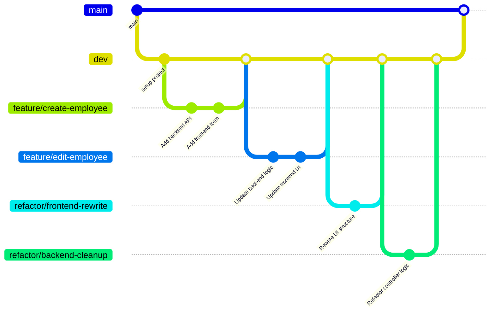

# Employee Creator Full-Stack Web Application

<!-- [](https://github.com/carriegale2710/employee-creator/actions/workflows/spring-ec2-deploy.yml) -->

[](https://github.com/carriegale2710/employee-creator/actions/workflows/spring-boot-test.yml) [](https://github.com/carriegale2710/employee-creator/actions/workflows/react-deploy.yml) [](https://opensource.org/licenses/MIT)

The documentation for this project is split up into backend vs front-end specific locations in the code base. They include more details like build steps, testing and change logs.

| Location                                         | Purpose                                                 |
| ------------------------------------------------ | ------------------------------------------------------- |
| See `README.md` (this file)                      | 🔷 High-level overview of the entire full-stack project |
| See [`employee/README.md`](employee/README.md)   | ⚙️ Backend-specific setup, API docs, DB, test config.   |
| See [`front-end/README.md`](front-end/README.md) | 🎨 Frontend-specific setup, dev commands, tests         |

```markdown
📁 employee-creator/
├── 📄 README.md (high-level overview) //you are here
├── 📁 employee/
│   ├── 📄 README.md (backend-specific)
│   └── 📄 CHANGELOG.md (backend changes)
└── 📁 front-end/
    ├── 📄 README.md (frontend-specific)
    └── 📄 CHANGELOG.md (frontend changes)
```

## Introduction

### What it is

Employee Creator is a full-stack CRUD web app built with Java Spring Boot and React TypeScript. It allows users to manage employee records (add, view, edit, delete). The project demonstrates frontend/backend integration, RESTful API design, form validation, testing, and deployment.

### Why I built it

This project was created to practice building production-ready applications with testing, responsive UI, and scalable architecture. It also mirrors typical enterprise apps used in HR systems.

---

## Demo & Snippets

<!-- - [x] Include hosted link: TBA -->

### Hosted Links:

Back-end API:
`ec2-3-107-209-102.ap-southeast-2.compute.amazonaws.com:8080/employees`

Front-end app:
`https://d3bcyx0s1yb5do.cloudfront.net/`

<!-- - [ ] Include images of app if CLI or Client App -->

<!--
//TODO - (replace with own finished front-end UI upon completion)

### Feature 1: Employee List

(TBA)

### Feature 2: New Employee Form

(TBA) -->

---

## Techstack and why

| Layer      | Technology                              | Why I chose it                      |
| ---------- | --------------------------------------- | ----------------------------------- |
| Backend    | Java, Spring Boot                       | Production-grade APIs, type safety  |
| DB         | MySQL, JPA                              | SQL schema control, ORM integration |
| Frontend   | React, TypeScript, Vite                 | SPA structure, compile-time safety  |
| Styling    | Tailwind (TBD) CSS / SCSS               | Component-level styling, responsive |
| Testing    | JUnit, Mockito, REST Assured, H2        | API e2e + unit tests, mock data     |
| Deployment | AWS EC2 (Backend API) S3 (Front-end UI) | Easy CI/CD, low costs               |

---

## Build Steps

<!-- - how to build / run project
- use proper code snippets if there are any commands to run -->

<!-- ## Build - Quickstart

put quickstart version here -->

Refer to 'Build Steps' instructions in these READMEs.

- [Building Backend API](employee/README.md)
- [Building Front-end UI](front-end/README.md)

## Testing

| Type       | Tools Used       | Status |
| ---------- | ---------------- | ------ |
| Unit Tests | JUnit + Mockito  | ✅     |
| E2E Tests  | REST Assured, H2 | ✅     |
| Frontend   | Vitest / Zod     | ⏳     |

```bash
./mvnw test      # backend
npm run test     # frontend (if added)

```

---

## Design Goals

### MVP Objectives

See [Project Requirements](project-brief.md)

- Build a full-stack app:
  - Backend: Spring Boot REST API (CRUD for employees)
  - Frontend: React + TypeScript
- Must be production-ready, testable, and deployed
- Include:

  - Basic validations
  - Responsive layout
  - Hosting (Heroku, AWS, etc.)

### QA Checklist

#### 🔧 Backend (Spring Boot)

- [x] App compiles and runs
- [x] API has working CRUD endpoints (GET, CREATE, DELETE + EDIT)
- [x] Unit + end-to-end tests (JUnit, Mockito)
- [x] Error handling implemented
- [x] Logging strategy in place

#### 💻 Frontend (React + TypeScript)

- [x] React app compiles and runs (Vite)
- [ ] Basic CRUD employee functionality works -testing
- [ ] Form validation added -testing
- [ ] Optional testing included (Vitest/Zod) -testing
- [x] UI styled + responsive (SCSS/Tailwind) - use tailwind

#### 🚚 Delivery & Deployment (Both)

- [x] README includes clear setup steps for both API and Web app (local dev)
- [x] Hosting link works (Heroku, AWS, Azure, etc.)
- [x] App is production-ready
- [ ] Code is clean + well documented
- [ ] Codebase is understandable and maintainable
- [ ] Bug-free and everything compiles + runs as expected

## Design Approach

<!-- ### Implementation

Why did you implement this the way you did? -->

---

## Implementation

<!-- Why did you implement this the way you did? -->

### Backend decisions

- Included a contracts and departments table with a `one-to-many relationship` for `employees -> contracts` and `departments -> contracts`
- This allows for flexible, quicker UX when updating of DB records via in FE client app with only minor updates eg. salary, contract dates etc.

### Front-end decisions

- Used top-down TDD to define backend before connecting to frontend.
- Write up basic tests before coding to understand functionality, entity shapes & edge cases.

---

### Features

Note: \* = MVP (priority)

#### 👩‍🏭 Employee Form

Employees can be added, updated, deleted in Employee form by clicking on 'Edit' in the Employee List Page.

| BE         | FE  | Feature             | User Wants To...       | So They Can...            | User should be able to...                                                        |
| ---------- | --- | ------------------- | ---------------------- | ------------------------- | -------------------------------------------------------------------------------- |
| pagination | x   | \*`List Employees`  | See all employees      | Review records            | Click link to view a _paginated list_ of all employee records                    |
| x          | x   | \*`Create Employee` | Add a new employee     | Register new hire         | Click button that opens a form to add a new employee as a new record in DB       |
| x          | x   | \*`Delete Employee` | Delete employee        | Remove old record         | Click a button to delete a record of an existing employee in DB                  |
| x          | x   | \*`Update Employee` | Edit existing employee | Fix errors or update info | Click an edit button that opens a form pre-filled with data to update the record |

#### 📄 Contract Form

Each **employee can have multiple contracts**, and contracts are managed separately but linked to employees (like foreign key via `employeeId`).

| BE            | FE  | Feature                                   | User Wants To...          | So They Can...                       | User should be able to...                                                  |
| ------------- | --- | ----------------------------------------- | ------------------------- | ------------------------------------ | -------------------------------------------------------------------------- |
| x             | x   | \*`Submit a new Contract` (complete form) | Add a new contract        | Register new agreement               | Click button that opens a form to add a new contract linked to an employee |
|               |     | \*`View Current Contract of an Employee`  | View a specific contract  | Check specific terms/details         | Enter a contract ID to fetch and display its details                       |
| pass BE -> FE | x   | `View list of Departments`                | View current departments  | Avoid looking them up                | Select available department from simple dropdown in Contract Form          |
|               |     | `Create Department`                       | Create new department tag | Update any renamed / new departments | Have option to use a simple department name input in Contract form         |

---

## Known issues

<!-- Remaining bugs, things that have been left unfixed:

Features that are buggy / flimsy/not functional yet: -->

Front-end:

- [25/07/25] Contract form UX is tedious/misleading (based on feedback):
  - not clear that contracts need existing employee ID
  - users might not remember employee ID number

Backend:

---

## Challenges

- Setting up **GitHub Actions** was tricky—required many commits to get configs right.
- Deployment went smoothly, but linking backend & frontend on AWS EC2 with a custom domain took some tweaking of security settings.
- Maintaining TDD was a challenge under a tight deadline. Found a middle ground of implementing tests after testing in browser to be more rewarding due to lack of specifications - made writing tests first difficult.
- Setting up Github Actions was a bit tricky in terms of config. Too many commits to test it.
- Maintaining a cleaner git commit history and merging with multiple branches

---

## What I Learned

### Test Driven Development (TDD)

- Writing end-to-end backend tests helped clarify features and edge cases.
- Seeing tests pass was motivating and boosted momentum.
- Reduced time spent debugging during refactors by catching issues early.

| Phase       | Action                                           |
| ----------- | ------------------------------------------------ |
| 🔴 Red      | Write a test for a feature you haven’t built yet |
| 🟢 Green    | Build the simplest code to pass the test         |
| 🟡 Refactor | Clean up code while keeping tests passing        |

**Pros:**

- Defined project scope early
- Increased confidence with regression tests
- Motivation from green test ticks

**Cons:**

- Slowed me down as project grew
- Felt like overkill for small features

---

### Workflow Strategy

An aim of this project was to understand best practices used in business settings, including:

- **Microservices architecture** thinking
- **Separation of concerns** principle
- **Team workflow** considerations
- **Production deployment** patterns

#### Git Workflow

- Using **main** + **dev** branches mimicked team workflows — great for practicing merges and resolving conflicts.
- GitHub Actions for CI/CD and testing was challenging but rewarding.
- Branching for each feature felt a bit overkill for solo work but valuable production protocol practice for team projects.
- Learning advanced Git commands like rebase and [squashing commits](https://www.datacamp.com/tutorial/git-squash-commits) was helpful for clean up merge histories

Example:



#### Documentation Strategy: READMEs + Changelogs

- Split up documentation between back-end and front-end, and having changelogs helps keptp it readable and focused. This follows [monorepo](https://monorepo.tools/#what-is-a-monorepo) patterns often used in big tech industries.

- Mini progress updates in CHANGELOG helped document solo work:

  - Easier version control
  - Helps track scope creep and blockers
  - Refreshes context after breaks

---

## Licensing Details

<!-- What type of license are you releasing this under? -->

MIT License.

---
