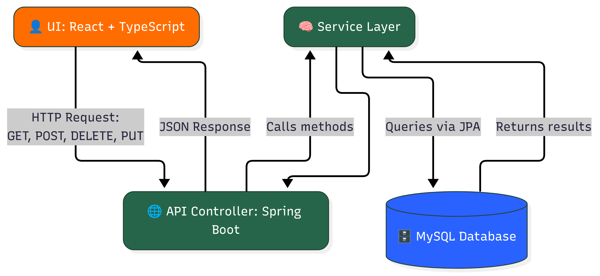
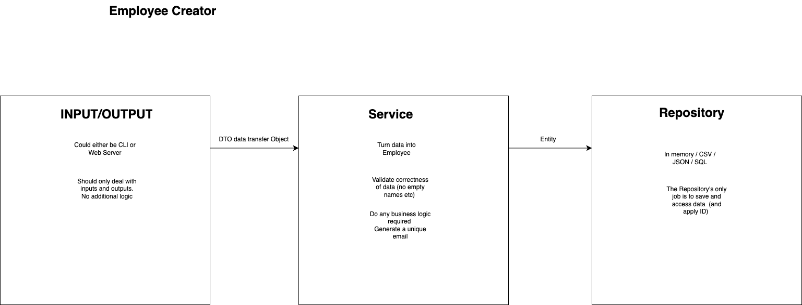

# Employee Creator

[](https://github.com/carriegale2710/employee-creator/actions/workflows/main.yml) [](https://github.com/carriegale2710/employee-creator/actions/workflows/maven.yml) [](https://github.com/carriegale2710/employee-creator/actions/workflows/test.yml)

## Introduction

### What it is

Employee Creator is a full-stack CRUD web app built with Java Spring Boot and React TypeScript. It allows users to manage employee records (add, view, edit, delete). The project demonstrates frontend/backend integration, RESTful API design, form validation, testing, and deployment.

### Why I built it

This project was created to practice building production-ready applications with testing, responsive UI, and scalable architecture. It also mirrors typical enterprise apps used in HR systems.

## Demo & Snippets

- [ ] Include hosted link: TBA
- [ ] Include images of app if CLI or Client App

//TODO - (replace with own finished front-end UI upon completion)

### Feature 1: Employee List

(TBA)

### Feature 2: New Employee Form

(TBA)

---

## Techstack and why

| Layer      | Technology                       | Why I chose it                      |
| ---------- | -------------------------------- | ----------------------------------- |
| Backend    | Java, Spring Boot, JPA           | Production-grade APIs, type safety  |
| DB         | MySQL, JPA                       | SQL schema control, ORM integration |
| Frontend   | React, TypeScript, Vite          | SPA structure, compile-time safety  |
| Styling    | Tailwind (TBD) CSS / SCSS        | Component-level styling, responsive |
| Testing    | JUnit, Mockito, REST Assured, H2 | API e2e + unit tests, mock data     |
| Deployment | Heroku (TBD)                     | Easy CI/CD                          |

### Other notes

1. Backend:

   - Java: using OOP is ideal for defining Employee classes with interfaces - can be extended upon.
   - Spring: Easier to manage dependency injection and database updates for RESTful APIs.

2. Frontend:
   - React: SPA for responsive layout
   - Typescript: validating forms for user input before being sent to DB saves time in both DX and UX.
   - SCSS/Tailwind: For modular, reusable styles and themes based on design systems.

---

## Build Steps

- how to build / run project
- use proper code snippets if there are any commands to run

### Setup

```bash
# Clone the repo
git clone https://github.com/your-username/employee-creator.git
cd employee-creator

# Backend setup
./mvnw spring-boot:run

# Frontend setup
cd frontend
npm install
npm run dev

```

### Running the App Locally (macOS & Windows)

---

#### 🐬 1. Install MySQL

- **macOS**

  ```bash
  brew install mysql
  brew services start mysql
  ```

- **Windows**

  1. Download [MySQL Installer](https://dev.mysql.com/downloads/installer/)
  2. Install MySQL Server
  3. Make sure it's running as a service

---

#### 🛠️ 2. Create Database

Open MySQL shell:

```bash
mysql -u root -p
```

Then run:

```sql
CREATE DATABASE your_database_name;
```

> ✅ **Skip user creation if you're using `root` for local dev**
> Otherwise:
>
> ```sql
> CREATE USER 'your_user'@'localhost' IDENTIFIED BY 'your_password';
> GRANT ALL PRIVILEGES ON your_database_name.* TO 'your_user'@'localhost';
> FLUSH PRIVILEGES;
> ```

---

#### 📄 3. Add `.env` File

Create a `.env` file in the project root:

```env
DB_NAME=your_database_name
MYSQL_USER=your_user_or_root
MYSQL_PASS=your_password
```

---

#### 🧯 4. Fix Socket Errors [macOS Only]

If you get MySQL socket errors on Mac, force TCP:

```properties
spring.datasource.url=jdbc:mysql://127.0.0.1:3306/${DB_NAME}
```

---

#### ▶️ 5. Run the App

```bash
./mvnw spring-boot:run
```

Or use your IDE (IntelliJ, VSCode, etc.)

---

### Endpoints:

Once running, your API will be available at:

```
http://localhost:8080
```

Opening this in your browser should return "Hello, world".
Use [Postman](https://www.postman.com/downloads/) or a browser (for GET requests) to test.

- **GET all employees:**
  `http://localhost:8080/api/employees`

- **GET single employee:**
  `http://localhost:8080/api/employees/{id}`

- **POST new employee:**

  - Method: `POST`
  - URL: `http://localhost:8080/api/employees`
  - Body (JSON):

    ```json
    {
      "firstName": "Timmy",
      "lastName": "Turner",
      "email": "timmy@fairy.com"
    }
    ```

---

## Testing

| Type       | Tools Used       | Status |
| ---------- | ---------------- | ------ |
| Unit Tests | JUnit + Mockito  | ✅     |
| API Tests  | REST Assured, H2 | ✅     |
| Frontend   | Vitest / Manual  | ⏳     |

```bash
./mvnw test      # backend
npm run test     # frontend (if added)

```

### TDD Workflow

| Phase       | Action                                           |
| ----------- | ------------------------------------------------ |
| 🔴 Red      | Write a test for a feature you haven’t built yet |
| 🟢 Green    | Build the simplest code to pass the test         |
| 🟡 Refactor | Clean up code while keeping tests passing        |

---

## Design Goals / Approach

See [Project Requirements](project-brief.md)

### Overview

- Build a full-stack app:
  - Backend: Spring Boot REST API (CRUD for employees)
  - Frontend: React + TypeScript
- Must be production-ready, testable, and deployed
- Include:

  - Basic validations
  - Responsive layout
  - Hosting (Heroku, AWS, etc.)

### Implementation

Why did you implement this the way you did?

- Used enum for department to enforce consistency.
- Used top-down TDD to define backend before connecting to frontend.
  - Write up basic tests before coding to understand functionality, entity shapes & edge cases.
- Used Tailwind for quick responsive UI with minimal setup.

---

## Features

- What features does the project have? list them...

| ID  | Feature         | Description                            |
| --- | --------------- | -------------------------------------- |
| F1  | List Employees  | View a paginated list of all employees |
| F2  | Create Employee | Submit a form to add a new employee    |
| F3  | Delete Employee | Remove an employee from the system     |

### API Endpoints

| ID  | Method   | Endpoint         | Input             | Output Data   | Success Response |
| --- | -------- | ---------------- | ----------------- | ------------- | ---------------- |
| 1   | `GET`    | `/employees`     | none              | DB List       | `200 OK`         |
| 2   | `POST`   | `/employees`     | CreateEmployeeDTO | employee data | `201 Created`    |
| 3   | `DELETE` | `/employees/:id` | employee id       | no content    | `204 No Content` |

#### User Stories

| ID  | Feature           | User Wants To...   | So They Can...    | User should be able to...                                                  |
| --- | ----------------- | ------------------ | ----------------- | -------------------------------------------------------------------------- |
| 1   | `List Employees`  | See all employees  | Review records    | Click link to view a paginated list of all employee records                |
| 2   | `Create Employee` | Add a new employee | Register new hire | Click button that opens a form to add a new employee as a new record in DB |
| 3   | `Delete Employee` | Delete employee    | Remove old record | Click a button to delete a record of an existing employee in DB            |

#### User Flows

\*Red borders are core MVP features


See [User Flows Mermaid Diagram](https://www.mermaidchart.com/app/projects/dc3bdcc4-0838-4954-b61e-39ed0000a222/diagrams/7ff245ec-49e3-47a7-af4d-bf5ce3f4158b/version/v0.1/edit)

### App Layers: (update later)




### Employee Schema

Data types for properties of Employee class.

- id : unique number (generated in backend)
- first_name : string
- last_name : string
- email : unique string (generated in backend)
- department : enum (dropdown in UI)
- startDate : Date (datepicker UI, validation needed)

See more in [Schemas](assets/data/README.md)

### CreateEmployeeDTO Schema

This is the type of data that will be sent from the client side form to create a new employee in DB. Note: A unique Id & email (if not entered) should be generated in backend upon creation.

- first_name : string
- last_name : string
- department : enum (dropdown in UI) (optional)
- email : (optional, if null, generate based on name)
- startDate : Date (datepicker UI, validation needed)

Note: 🔒 "department" must be one of:
"ENGINEERING", "SALES", "HUMAN_RESOURCES", "MARKETING", "FINANCE"

---

## Change logs

### 05/07/2025 - Backend API Project Setup

- Installed SpringBoot and dependencies
- Setup application.properties file for mySQL
- Decided on SQL schema for employee database
- Defining data types for employees table in `assets/data/README.md`
- Linking to SQL and testing table database syncing

### 06/07/2025 - 07/07/2025 Backend API Testing setup

General

- Mapping out endpoints and status codes expected for http requests
- Created Mermaid charts for app layers and core user flows
- Introduction, build steps, testing stack research
- Research on TDD framework
- Cleaning up assets and documentation org//

Backend API

- Created simple HomeController and tested app runs in localhost:8080 browser
- Create Employee entity with getters and setters
- Creates basic employee controller, service, repository classes.
- Write code for basic get method

Backend E2E Test

- Installs `spring-boot-starter-test dependency` which includes JUnit, Mockito, and other useful testing libraries.
- Installs dependency for H2 database for testing with separate db - avoid breaking from actual DB.
- Installs Rest Assured Library for writing automated test that send requests during testing.
- Adds records for e2e test setup using H2 database for mocking with dummy data
- Write simple sanity check test that fails if app cannot start
  - Creates basic test for getAll() -> getAllEmployees_EmployeesInDB_ReturnsSuccess()
- test badges update - Github actions

### 07/07/2025 - Basic REST API CRUD endpoints

#### Endpoints

- getAll method
- getById method
- create method
- deleteById method

#### Tests

- outlined e2e test cases and edges for new all endpoints
- fixed application.properties config bug for test suite
- Created config folder for ModelMapper library - easier to create new entities compared to manual setters

### In progress

- create JSON schema for e2e test for creating new employees in DB

### Sprint

- write up basic integration tests
- outlining unit tests
- writing unit tests

### Backlog

- react front-end
- deployment test

---

## QA Checklist

| Area     | Goals                                                                                                                                                                                                                                                                                           |
| -------- | ----------------------------------------------------------------------------------------------------------------------------------------------------------------------------------------------------------------------------------------------------------------------------------------------- |
| Backend: | - App compiles and runs (Spring Boot)<br>- API has 3 working CRUD endpoints (GET, POST, DELETE)<br>- Unit/e2e tests run and pass ( J-Unit, Mockito)<br>- Error handling exists<br>- Logging strategy in place ( )                                                                               |
| Frontend | - Tech-stack: React + Typescript<br>- React app compiles and runs (Vite)<br>- Create and view employee working<br>- Validation added (forms)<br>- Testing (opt) (Vitest)<br>- Form + list are styled and responsive (SCSS/Tailwind)                                                             |
| Delivery | - README includes setup steps to compile and run the API and the Web app in localhost.<br>- Hosting link works (Heroku, AWS, Azure, etc.)<br>- Code is clean and documented.<br>- Production ready.<br>- Understandable and maintainable by other developers.<br>- Bug free, compiles and work. |

## Known issues

Remaining bugs, things that have been left unfixed

Features that are buggy / flimsy

---

## Future Goals

- What are the immediate features you'd add given more time / ideas parking lot:
- Find employee by id
- Search Bar (find by name match)

## Learning Curves - What did you struggle with?

- What? Why? How?
- Setting up Github Actions was a bit tricky in terms of config. Too many commits to test it.

---

## Licensing Details

- What type of license are you releasing this under?

---

## Related projects, reimplementations

- link client app README here later

---

## Appendix
