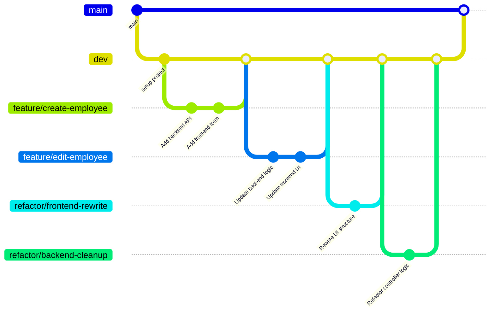

# Employee Creator Full-Stack Web Application

<!-- [](https://github.com/carriegale2710/employee-creator/actions/workflows/spring-ec2-deploy.yml) -->

[](https://github.com/carriegale2710/employee-creator/actions/workflows/spring-boot-test.yml) [](https://github.com/carriegale2710/employee-creator/actions/workflows/react-deploy.yml) [](https://opensource.org/licenses/MIT)

### Documentation - Note

This documentation for this project is split up into backend vs front-end specific locations in the code base. They include more details like build steps, testing and change logs.

| Location                                     | Purpose                                                 |
| -------------------------------------------- | ------------------------------------------------------- |
| `README.md` (this file)                      | 🔷 High-level overview of the entire full-stack project |
| [`employee/README.md`](employee/README.md)   | ⚙️ Backend-specific setup, API docs, DB, test config.   |
| [`front-end/README.md`](front-end/README.md) | 🎨 Frontend-specific setup, dev commands, tests         |

## Introduction

### What it is

Employee Creator is a full-stack CRUD web app built with Java Spring Boot and React TypeScript. It allows users to manage employee records (add, view, edit, delete). The project demonstrates frontend/backend integration, RESTful API design, form validation, testing, and deployment.

### Why I built it

This project was created to practice building production-ready applications with testing, responsive UI, and scalable architecture. It also mirrors typical enterprise apps used in HR systems.

## Demo & Snippets

<!-- - [x] Include hosted link: TBA -->

### Hosted Links:

Back-end API:
`ec2-3-107-209-102.ap-southeast-2.compute.amazonaws.com:8080/employees`

Front-end app:
`https://d3bcyx0s1yb5do.cloudfront.net/`

<!-- - [ ] Include images of app if CLI or Client App -->

<!--
//TODO - (replace with own finished front-end UI upon completion)

### Feature 1: Employee List

(TBA)

### Feature 2: New Employee Form

(TBA) -->

---

## Techstack and why

| Layer      | Technology                              | Why I chose it                      |
| ---------- | --------------------------------------- | ----------------------------------- |
| Backend    | Java, Spring Boot                       | Production-grade APIs, type safety  |
| DB         | MySQL, JPA                              | SQL schema control, ORM integration |
| Frontend   | React, TypeScript, Vite                 | SPA structure, compile-time safety  |
| Styling    | Tailwind (TBD) CSS / SCSS               | Component-level styling, responsive |
| Testing    | JUnit, Mockito, REST Assured, H2        | API e2e + unit tests, mock data     |
| Deployment | AWS EC2 (Backend API) S3 (Front-end UI) | Easy CI/CD, low costs               |

### Other notes

1. Backend:

   - Java: using OOP is ideal for defining Employee classes with interfaces - can be extended upon.
   - Spring: Easier to manage dependency injection and database updates for RESTful APIs.

2. Frontend:
   - React: SPA for responsive layout
   - Typescript: validating forms for user input before being sent to DB saves time in both DX and UX.
   - SCSS/Tailwind: For modular, reusable styles and themes based on design systems.

---

## Build Steps

<!-- - how to build / run project
- use proper code snippets if there are any commands to run -->

<!-- ## Build - Quickstart

put quickstart version here -->

Refer to 'Build Steps' instructions in these READMEs.

- [Building Backend API](employee/README.md)
- [Building Front-end UI](front-end/README.md)

## Testing

| Type       | Tools Used       | Status |
| ---------- | ---------------- | ------ |
| Unit Tests | JUnit + Mockito  | ✅     |
| E2E Tests  | REST Assured, H2 | ⏳     |
| Frontend   | Vitest / Zod     | ⏳     |

```bash
./mvnw test      # backend
npm run test     # frontend (if added)

```

---

## Design Goals / Approach

### MVP Objectives

See [Project Requirements](project-brief.md)

- Build a full-stack app:
  - Backend: Spring Boot REST API (CRUD for employees)
  - Frontend: React + TypeScript
- Must be production-ready, testable, and deployed
- Include:

  - Basic validations
  - Responsive layout
  - Hosting (Heroku, AWS, etc.)

### TDD Workflow

| Phase       | Action                                           |
| ----------- | ------------------------------------------------ |
| 🔴 Red      | Write a test for a feature you haven’t built yet |
| 🟢 Green    | Build the simplest code to pass the test         |
| 🟡 Refactor | Clean up code while keeping tests passing        |

### Production Protocol



---

<!-- ### Implementation

Why did you implement this the way you did? -->

---

## Backend Design Goals / Approach

<!-- Why did you implement this the way you did? -->

### Backend decisions

- Included a contracts and departments table with a `one-to-many relationship` for `employees -> contracts` and `departments -> contracts`
- This allows for flexible, quicker UX when updating of DB records via in FE client app with only minor updates eg. salary, contract dates etc.

### Front-end decisions

- Used top-down TDD to define backend before connecting to frontend.
- Write up basic tests before coding to understand functionality, entity shapes & edge cases.

### Features

Note: \* = MVP (priority)

#### 👩‍🏭 Employee Maker

| BE  | FE  | Feature                            | User Wants To...                  | So They Can...            | User should be able to...                                                        |
| --- | --- | ---------------------------------- | --------------------------------- | ------------------------- | -------------------------------------------------------------------------------- |
| x   | x   | \*`List Employees`                 | See all employees                 | Review records            | Click link to view a paginated list of all employee records                      |
| x   |     | \*`Create Employee`                | Add a new employee                | Register new hire         | Click button that opens a form to add a new employee as a new record in DB       |
| x   |     | \*`Delete Employee`                | Delete employee                   | Remove old record         | Click a button to delete a record of an existing employee in DB                  |
| x   |     | \*`Update Employee`                | Edit existing employee            | Fix errors or update info | Click an edit button that opens a form pre-filled with data to update the record |
| x   |     | `Find Employee by ID/name`         | Search specific employee          | View or confirm details   | Enter an ID/name in a search box and fetch/display the record if it exists       |
|     |     | `Filter List of current Employees` | See all employees currently hired | Review records            | Click link to view a paginated list of all employee records                      |

#### 📄 Contract Maker

Each **employee can have multiple contracts**, and contracts are managed separately but linked to employees (like foreign key via `employeeId`).

| BE  | FE  | Feature                                   | User Wants To...         | So They Can...               | User should be able to...                                                  |
| --- | --- | ----------------------------------------- | ------------------------ | ---------------------------- | -------------------------------------------------------------------------- |
|     |     | \*`Submit a new Contract` (complete form) | Add a new contract       | Register new agreement       | Click button that opens a form to add a new contract linked to an employee |
|     |     | \*`View Current Contract of an Employee`  | View a specific contract | Check specific terms/details | Enter a contract ID to fetch and display its details                       |

<!-- ### 🏢 Department Features

| BE  | FE  | Feature                    | Front-End Responsibilities                                              | Back-End Responsibilities                                                    |
| --- | --- | -------------------------- | ----------------------------------------------------------------------- | ---------------------------------------------------------------------------- |
|     |     | `Create Department`        | - Form UI for department name input<br>- Submit button                  | - POST `/departments` endpoint<br>- Validate & save to DB                    |
|     |     | `Update Department`        | - Edit form pre-filled with dept name<br>- Submit updates               | - PUT `/departments/{id}` endpoint<br>- Validate & update in DB              |
|     |     | `List/Search Departments`  | - Table or list UI<br>- Search/filter input field                       | - GET `/departments` endpoint<br>- Support query params for filtering        |
|     |     | `Delete Department`        | - Delete button (with confirmation)<br>- Refresh list on success        | - DELETE `/departments/{id}` endpoint<br>- Remove from DB                    |
|     |     | `View Department Details`  | - Department details page or modal<br>- Show list of assigned employees | - GET `/departments/{id}` endpoint<br>- Include related employees/contracts  | -->

## QA Checklist

### 🔧 Backend (Spring Boot)

- [x] App compiles and runs
- [ ] API has working CRUD endpoints (GET, CREATE, DELETE + EDIT)
- [x] Unit + end-to-end tests (JUnit, Mockito)
- [ ] Error handling implemented
- [x] Logging strategy in place

### 💻 Frontend (React + TypeScript)

- [x] React app compiles and runs (Vite)
- [ ] Basic CRUD employee functionality works
- [ ] Form validation added
- [x] Optional testing included (Vitest/Zod)
- [ ] UI styled + responsive (SCSS/Tailwind)

### 🚚 Delivery & Deployment (Both)

- [ ] README includes clear setup steps for both API and Web app (local dev)
- [ ] Hosting link works (Heroku, AWS, Azure, etc.)
- [ ] Code is clean + well documented
- [ ] App is production-ready
- [ ] Codebase is understandable and maintainable
- [ ] Bug-free and everything compiles + runs as expected

---

## Known issues

<!-- Remaining bugs, things that have been left unfixed:

Features that are buggy / flimsy/not functional yet: -->

- Front-end app is not switching the VITE api key according to env (dev vs production mode).
- Duplicate data (for email) posting needs to return BAD_REQUEST status code.
- [14/07/25] Custom domain for EC2 : for fetching safely from front-end (otherwise error below)
  -> stuck at AWS security settings : health check failing, need to look at EC2 security group setting again

- [15/07/25] Need to audit API logging and react app fetching for any security holes

---

## Future Goals

<!-- What are the immediate features you'd add given more time / ideas parking lot: -->

Employees:

- [Employee Search Bar](employee/assets/diagrams/flows/Searchbar.md) with employee id or first/last name find by name match with query params)

Contracts:

- `Find all past Contracts of an Employee` | View all contracts for 1 employee | Track one employee’s history | Click from employee page to view all contracts linked to that employee |
- `Save a draft Contract` (incomplete form) | Edit an existing contract | Fix terms or extend a contract | Click an edit button to open a form with existing values and update the record |
- `Find all saved drafts of an Employee` | View all contracts for 1 employee | Track one employee’s history | Click from employee page to view all contracts linked to that employee |

Other:

- Add API Pagination (with findAll(Pageable pageable) from JpaRepository)
- Login and authentication service/security (for admin access only) - Context API for frontend?

---

## Learning & Challenges

- Setting up **GitHub Actions** was tricky—required many commits to get configs right.
- Deployment went smoothly, but linking backend & frontend on AWS EC2 with a custom domain took some tweaking of security settings.
- Maintaining TDD was a challenge under a tight deadline.  Found a middle ground of implementing tests after testing in browser to be more rewarding due to lack of specifications - made writing tests first difficult. 

## What I Learned

### Test Driven Development (TDD)

- Writing end-to-end backend tests helped clarify features and edge cases.
- Seeing tests pass was motivating and boosted momentum.
- Reduced time spent debugging during refactors by catching issues early.

**Pros:**  
- Defined project scope early  
- Increased confidence with regression tests  
- Motivation from green test ticks  

**Cons:**  
- Slowed me down as project grew  
- Felt like overkill for small features  

### Documentation Strategy

- Mini progress updates in README proved better than Trello for solo work:
  - Easier version control  
  - Helps track scope creep and blockers  
  - Refreshes context after breaks  

### Git & Workflow

- Using **main** + **dev** branches mimicked team workflows — great for practicing merges and resolving conflicts.
- GitHub Actions for CI/CD and testing was challenging but rewarding.
- Branching felt a bit overkill for solo work but valuable practice for team projects.

## Licensing Details

<!-- What type of license are you releasing this under? -->

MIT License.

---

<!-- ## Related projects, reimplementations, misc.

### Client App UI

See related documentation for [React Client App](front-end/README.md). -->
