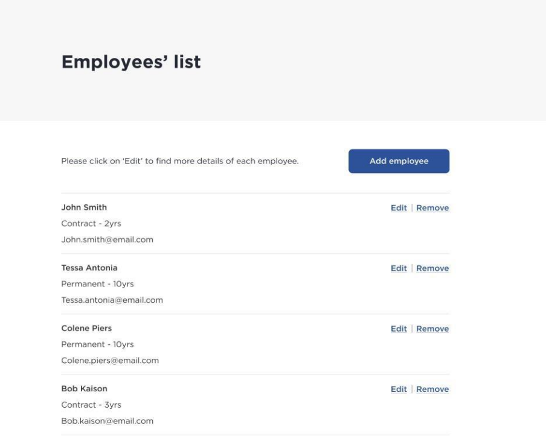

# Employee Creator

{add test badges here, all projects you build from here on out will have tests, therefore you should have github workflow badges at the top of your repositories: [Github Workflow Badges](https://docs.github.com/en/actions/monitoring-and-troubleshooting-workflows/adding-a-workflow-status-badge)}

[](https://github.com/carriegale2710/employee-creator/actions/workflows/main.yml)

## Demo & Snippets

- Include hosted link
- Include images of app if CLI or Client App

---

## Requirements / Purpose

### Purpose of project

Demonstrate understanding of writing RESTful APIs.

### Techstack and why

1. Backend:
   - Java: using OOP is ideal for defining Employee classes with interfaces - can be extended upon.
   - Spring: Easier to manage dependency injection and database updates for RESTful APIs.
2. Frontend:
   - React: SPA for responsive layout
   - Typescript: validating forms for user input before being sent to DB saves time in both DX and UX.

### MVP - Project Specification

[Project Brief](https://github.com/nology-tech/aus-post-course-guide/tree/main/projects/employee-creator)

- [ ] We need a web application to manage employees:
  - [ ] create
  - [ ] list
  - [ ] modify
  - [ ] delete
- [ ] The schema for the employee is left to the criteria of the candidate.

Also code should be:

- [ ] Production ready.
- [ ] Understandable and maintainable by other developers.
- [ ] Robust and handle error situations.
- [ ] Bug free, compile and work.
- [ ] Include instructions to compile and run the API and the Web app in localhost.
- [ ] Hosting (Heroku, AWS, Azure, etc.) is required.
- [ ] If your code includes unit tests you may use a unit test framework of your choice.

## Hints

### React hints

- React Redux is recommended.
  - You may want to use a Redux middlewear like thunks or epics to handle async actions
- Typescript is recommended.
- React hooks are recommended.
- You can include any other open source NPM library.
- Feel free to use your favorite CSS framework.
  - Tailwind is a good choice
- Feel free to use your favorite middleware.
- Add some basic validations on the form like:
  - [ ] input required
  - [ ] input max length
- Reccomended:
  - [ ] React Hook Form
  - [ ] Zod are reccomended
- The site should be responsive.
  - [ ] media queries
  - [ ] flexbox

### RESTful API hints

- The list can be a local database
  - [ ] MySQL is reccomended
- Implementing an API logging strategy.
  - [ ] Log2j **highly** reccomended
- [ ] Implementing error handling strategy.
- At least 3 endpoints are required:
  - [ ] To create an employee
  - [ ] To get a list of existing employees
  - [ ] To delete an employee

## Design Snippets

### Basic UI Example




### Example Backend Spring App


### Technology / Documentation Recommendations

#### Frontend

- [ ] Vite with `react-ts`
- [ ] Use SCSS instead of CSS, `npm install sass`
  - [ ] Or just use Tailwind
- [ ] React Form Hook for form validation & submission
  - https://react-hook-form.com/get-started
- [ ] Typescript React Cheatsheet
  - https://react-typescript-cheatsheet.netlify.app/docs/basic/getting-started/basic_type_exampleReact Cheat Sheet
- [ ] React Router for routes
  - https://reactrouter.com/en/main/start/tutorial

#### Backend

- Dependencies

  - [x] Spring Web,
  - [x] Validation I/O
  - [ ] Spring Testing
    - [ ] Rest assured
    - [ ] mockito
  - [x] Spring Data JPA
  - [x] MySQL Driver
  - [x] Spring Devtools

- application.properties starter:

```
spring.datasource.url=jdbc:mysql://localhost:3306/db_name
spring.datasource.username=root
spring.datasource.password=MyPass
spring.jpa.hibernate.ddl-auto=update
spring.jpa.properties.hibernate.dialect=org.hibernate.dialect.MySQL5InnoDBDialect
spring.jpa.generate-ddl=true
```

Testing

- https://spring.io/guides/gs/testing-web/
- https://www.baeldung.com/spring-mock-rest-template

Logging

- https://www.baeldung.com/spring-boot-logging

CORS Errors

- https://www.baeldung.com/spring-cors

API Semantics

- https://www.uniprot.org/help/rest-api-headers
- https://restfulapi.net/resource-naming/

---

## Build Steps

- how to build / run project
- use proper code snippets if there are any commands to run

---

## Design Goals / Approach

- Design goals:

  - Understandable and maintainable by other developers.
  - Robust and handle error situations.

- Why did you implement this the way you did?
  - Use a top-down approach for backend using TDD framework
    - Why? : write up basic tests before coding to understand functionality, entity shapes & edge cases.

---

## Features

- What features does the project have?
- list them...

---

## Known issues

- Remaining bugs, things that have been left unfixed
- Features that are buggy / flimsy

---

## Future Goals

- What are the immediate features you'd add given more time / ideas parking lot:

---

## Change logs

- Write a paragraph labelled with the date every day you work on the project to discuss what you've done for the say. Be specific about the changes that have happened for that day.

### 05/07/2025 - Backend Project Setup

- Install SpringBoot and dependencies
- Setup application.properties file for mySQL database seeder

## What did you struggle with?

- What? Why? How?

---

## Licensing Details

- What type of license are you releasing this under?

---

## Further details, related projects, reimplementations

- If it's an API, is there a client app that works with this project? link it
