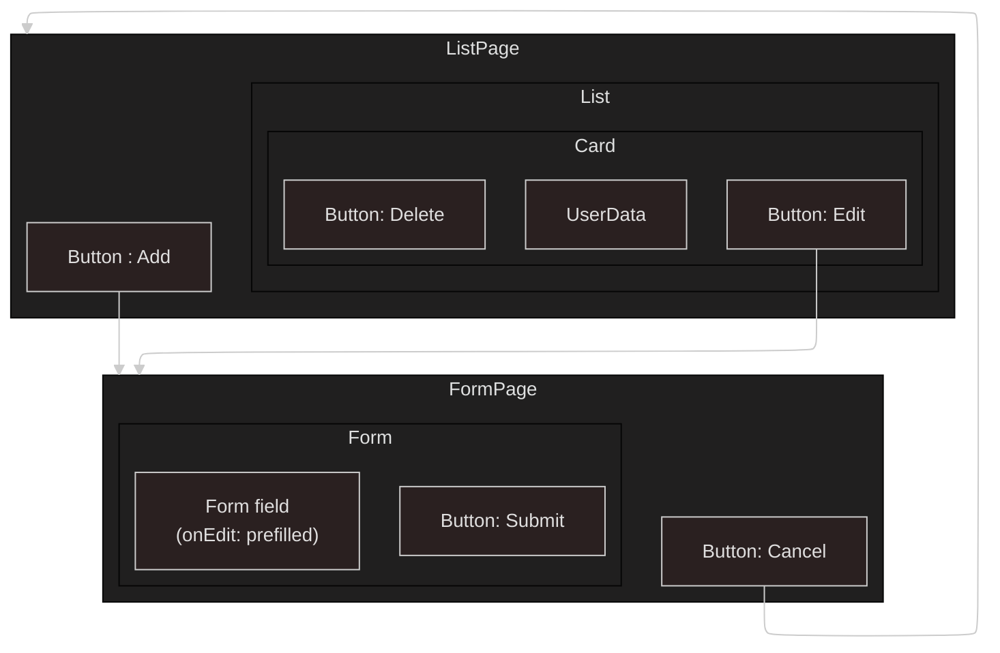
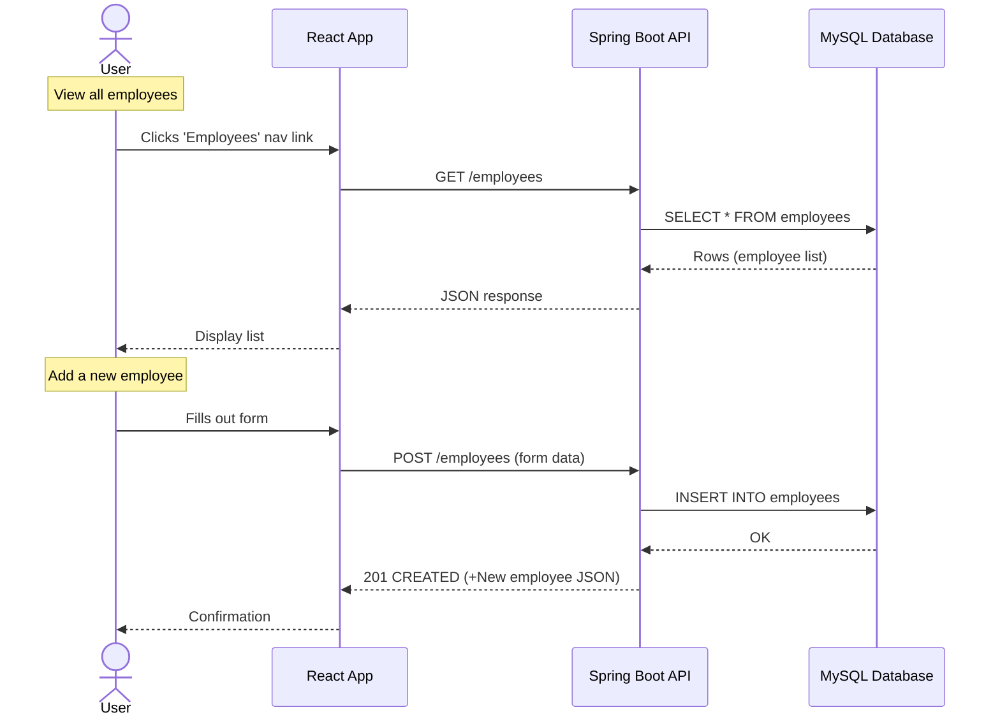

# Employee Creator

[](https://github.com/carriegale2710/employee-creator/actions/workflows/spring-ec2-deploy.yml) [](https://github.com/carriegale2710/employee-creator/actions/workflows/spring-boot-test.yml) [](https://github.com/carriegale2710/employee-creator/actions/workflows/react-deploy.yml)

## Introduction

### What it is

Employee Creator is a full-stack CRUD web app built with Java Spring Boot and React TypeScript. It allows users to manage employee records (add, view, edit, delete). The project demonstrates frontend/backend integration, RESTful API design, form validation, testing, and deployment.

### Why I built it

This project was created to practice building production-ready applications with testing, responsive UI, and scalable architecture. It also mirrors typical enterprise apps used in HR systems.

<!-- ## Demo & Snippets

- [ ] Include hosted link: TBA
- [ ] Include images of app if CLI or Client App

//TODO - (replace with own finished front-end UI upon completion)

### Feature 1: Employee List

(TBA)

### Feature 2: New Employee Form

(TBA) -->

---

## Techstack and why

| Layer      | Technology                       | Why I chose it                      |
| ---------- | -------------------------------- | ----------------------------------- |
| Backend    | Java, Spring Boot, JPA           | Production-grade APIs, type safety  |
| DB         | MySQL, JPA                       | SQL schema control, ORM integration |
| Frontend   | React, TypeScript, Vite          | SPA structure, compile-time safety  |
| Styling    | Tailwind (TBD) CSS / SCSS        | Component-level styling, responsive |
| Testing    | JUnit, Mockito, REST Assured, H2 | API e2e + unit tests, mock data     |
| Deployment | Heroku (TBD)                     | Easy CI/CD                          |

### Other notes

1. Backend:

   - Java: using OOP is ideal for defining Employee classes with interfaces - can be extended upon.
   - Spring: Easier to manage dependency injection and database updates for RESTful APIs.

2. Frontend:
   - React: SPA for responsive layout
   - Typescript: validating forms for user input before being sent to DB saves time in both DX and UX.
   - SCSS/Tailwind: For modular, reusable styles and themes based on design systems.

---

## Build Steps

<!-- - how to build / run project
- use proper code snippets if there are any commands to run -->

### Setup

```bash
# Clone the repo
git clone https://github.com/your-username/employee-creator.git
cd employee-creator

# Backend setup
./mvnw spring-boot:run

# Frontend setup
cd frontend
npm install
npm run dev

```

### Running the App Locally (macOS & Windows)

---

#### 🐬 1. Install MySQL

- **macOS**

  ```bash
  brew install mysql
  brew services start mysql
  ```

- **Windows**

  1. Download [MySQL Installer](https://dev.mysql.com/downloads/installer/)
  2. Install MySQL Server
  3. Make sure it's running as a service

---

#### 🛠️ 2. Create Database

Open MySQL shell:

```bash
mysql -u root -p
```

Then run:

```sql
CREATE DATABASE your_database_name;
```

> ✅ **Skip user creation if you're using `root` for local dev**
> Otherwise:
>
> ```sql
> CREATE USER 'your_user'@'localhost' IDENTIFIED BY 'your_password';
> GRANT ALL PRIVILEGES ON your_database_name.* TO 'your_user'@'localhost';
> FLUSH PRIVILEGES;
> ```

---

#### 📄 3. Add `.env` File

Create a `.env` file in the project root:

```env
DB_NAME=your_database_name
MYSQL_USER=your_user_or_root
MYSQL_PASS=your_password
```

---

#### 🧯 4. Fix Socket Errors [macOS Only]

If you get MySQL socket errors on Mac, force TCP:

```properties
spring.datasource.url=jdbc:mysql://127.0.0.1:3306/${DB_NAME}
```

---

#### ▶️ 5. Run the App

```bash
./mvnw spring-boot:run
```

Or use your IDE (IntelliJ, VSCode, etc.)

---

### Endpoints:

Once running, your API will be available at:

```
http://localhost:8080
```

Opening this in your browser should return "Hello, world".
Use [Postman](https://www.postman.com/downloads/) or a browser (for GET requests) to test.

- **GET all employees:**
  `http://localhost:8080/api/employees`

- **GET single employee:**
  `http://localhost:8080/api/employees/{id}`

- **POST new employee:**

  - Method: `POST`
  - URL: `http://localhost:8080/api/employees`
  - Body (JSON):

    ```json
    {
      "firstName": "Timmy",
      "lastName": "Turner",
      "email": "timmy@fairy.com"
    }
    ```

---

## Testing

| Type       | Tools Used       | Status |
| ---------- | ---------------- | ------ |
| Unit Tests | JUnit + Mockito  | ✅     |
| E2E Tests  | REST Assured, H2 | ⏳     |
| Frontend   | Vitest / Zod     | ⏳     |

```bash
./mvnw test      # backend
npm run test     # frontend (if added)

```

---

## Design Goals / Approach

### TDD Workflow

| Phase       | Action                                           |
| ----------- | ------------------------------------------------ |
| 🔴 Red      | Write a test for a feature you haven’t built yet |
| 🟢 Green    | Build the simplest code to pass the test         |
| 🟡 Refactor | Clean up code while keeping tests passing        |

### MVP Objectives

See [Project Requirements](project-brief.md)

- Build a full-stack app:
  - Backend: Spring Boot REST API (CRUD for employees)
  - Frontend: React + TypeScript
- Must be production-ready, testable, and deployed
- Include:

  - Basic validations
  - Responsive layout
  - Hosting (Heroku, AWS, etc.)

### User Stories to fufill

| ID  | Feature           | User Wants To...   | So They Can...    | User should be able to...                                                  |
| --- | ----------------- | ------------------ | ----------------- | -------------------------------------------------------------------------- |
| 1   | `List Employees`  | See all employees  | Review records    | Click link to view a paginated list of all employee records                |
| 2   | `Create Employee` | Add a new employee | Register new hire | Click button that opens a form to add a new employee as a new record in DB |
| 3   | `Delete Employee` | Delete employee    | Remove old record | Click a button to delete a record of an existing employee in DB            |

### Implementation

<!-- Why did you implement this the way you did? -->

<!-- - Used enum for department to enforce consistency.
- Used Tailwind for quick responsive UI with minimal setup. -->

- Used top-down TDD to define backend before connecting to frontend.
  - Write up basic tests before coding to understand functionality, entity shapes & edge cases.

#### React Components



<!--
### React Code Structure

| File                   | Purpose                                                  |
| ---------------------- | -------------------------------------------------------- |
| `employeeService.js`   | Handles raw API calls (GET, POST, PUT, DELETE)           |
| `useEmployees.js`      | Manages local state + calls service + keeps list in sync |
| `EmployeeListPage.jsx` | Renders the list and uses the hook                       |
| `EmployeeForm.jsx`     | Reuses hook to trigger updates after submit              |
 -->

---

## Features

| ID  | Feature         | Description                            |
| --- | --------------- | -------------------------------------- |
| F1  | List Employees  | View a paginated list of all employees |
| F2  | Create Employee | Submit a form to add a new employee    |
| F3  | Delete Employee | Remove an employee from the system     |
| F4  | View Employee   | View details of one employee in DB     |

### API Endpoints

| ID  | Method   | Endpoint         | Input             | Output Data | Success Response |
| --- | -------- | ---------------- | ----------------- | ----------- | ---------------- |
| 1   | `GET`    | `/employees`     | none              | DB List     | `200 OK`         |
| 2   | `POST`   | `/employees`     | CreateEmployeeDTO | DB Record   | `201 Created`    |
| 3   | `DELETE` | `/employees/:id` | employee id       | No Content  | `204 No Content` |
| 1   | `GET`    | `/employees/:id` | employee id       | DB Record   | `200 OK`         |

### Sequence Diagram



See [Full Sequence Diagram](assets/diagrams/sequence-diagram.md)

### Schemas

Data types for properties of Employee class.

- `id` : unique number (generated in backend)
- `firstName` : string
- `lastName` : string
- `email` : unique string (generated in backend)
<!-- - department : enum (dropdown in UI)
- startDate : Date (datepicker UI, validation needed) -->

#### CreateEmployeeDTO Schema

This is the type of data that will be sent from the client side form to create a new employee in DB.

- `firstName` : string
- `lastName` : string
- email : (optional, if null, generate based on name)
<!-- - department : enum (dropdown in UI) (optional)
- startDate : Date (datepicker UI, validation needed) -->

Note: A unique Id & email (if not entered) should be generated in backend upon creation.

<!-- Note: 🔒 "department" must be one of:
"ENGINEERING", "SALES", "HUMAN_RESOURCES", "MARKETING", "FINANCE" -->

See more in [Schemas](assets/data/README.md)

## Change logs

### 05/07/2025 - Backend API Project Setup

- Installed SpringBoot and dependencies
- Setup application.properties file for mySQL
- Decided on SQL schema for employee database
- Defining data types for employees table in `assets/data/README.md`
- Linking to SQL and testing table database syncing

### 06/07/2025 - 07/07/2025 Backend API Testing setup

General

- Mapping out endpoints and status codes expected for http requests
- Created Mermaid charts for app layers and core user flows
- Introduction, build steps, testing stack research
- Research on TDD framework
- Cleaning up assets and documentation org//

Backend API

- Created simple HomeController and tested app runs in localhost:8080 browser
- Create Employee entity with getters and setters
- Creates basic employee controller, service, repository classes.
- Write code for basic get method

Backend E2E Test

- Installs `spring-boot-starter-test dependency` which includes JUnit, Mockito, and other useful testing libraries.
- Installs dependency for H2 database for testing with separate db - avoid breaking from actual DB.
- Installs Rest Assured Library for writing automated test that send requests during testing.
- Adds records for e2e test setup using H2 database for mocking with dummy data
  - Creates basic test for `getAll()`
- test badges update - Github actions

### 08/07/2025 - Basic CRUD endpoints + Writing tests

Created endpoints for:

- `GET` `/employees` = [DB -> list (of records)]
- `GET` `/employees/{id}` = [DB -> record]
- `POST` `/employees` = [DB + record]
- `DELETE` `/employee/{id}` = [DB - record]

API Test Setup:

- Fixed Github workflows for automated testing (see badges at top)
- Outlined e2e test cases and edges for new all endpoints
- Fixed application.properties config bug for test suite
- Created config folder for ModelMapper library - easier to create new entities compared to manual setters
- Created JSON schema for e2e test for creating new employees in DB
- SmokeTest sanity check test
- writing unit tests for Service layer (business logic)

### 09/07/2025 - Front-end Planning + Creation

- deconstruct UI design mockups provided into React components using Figma (+ bonus data flow Mermaid diagram)
- install Vite + TypeScript + Scss to create React front-end
- create employee-service.ts to render fetch data from DB
- create basic React presentational components: List, Card, Button
- employee services: getAll() , getById()
- backend: Implemented Webconfig for CORS errors
- render and pass data from Page -> List -> Card
- basic scss styling of Card

### 10/07/2025 - Spring App EC2 Deployment

- fixed bug with env variables not loading into application.properties for backend by changing file name
- Successfully deployed backend Spring App to EC2 instance in AWS - Available at: `ec2-3-107-209-102.ap-southeast-2.compute.amazonaws.com:8080/employees`

### 11/07/2025 - S3 React Deployment

- Deployed React front-end as [static app](https://d3bcyx0s1yb5do.cloudfront.net/) in AWS S3 (Simple Storage Service):
- Created React build, test and deploy [Github workflow](.github/workflows/react-deploy.yml)

### 12/07/2025 - Custom Domain for API

- Created new healthcheck controller endpoint for testing load balancer

- Started: [Custom Domain for EC2](https://github.com/nology-tech/chicago-consultancy/tree/main/code-alongs/aws/adding-custom-domian-with-https) for fetching safely from front-end

  - error, stuck at "Test out your API" : "If it is not returning the expected response, or if the health check fails, you might need to look at your EC2 security group settings."
  <!-- message Martyna about it (maybe see discord/Fred) -->

- Started: Auto-deployment workflow for Spring App EC2 Deployment (not working yet) (on hold)

### 14/07/2025 - API Logging

- API logging strategy:
  - implemented SLF4J facade in EmployeeApplication controller class
  - created dev profile for console and file log formats and level filtering
  - configured SLF4J to use Log4j2 instead of default (Logback)
  - created log4j2-spring.xml for log configuration and formatting, with dev profile

### In progress

### Sprint

- pass BE basic e2e tests:

  - delete
  - create

- BE feature: Edit employee record

  - editById PUT method - TDD - write tests + function in parallel

- start writing tests for front-end

<!--

### Backlog

Front-end work

Form React UI for create/edit features:
- Create basic form inputs and submit button(use React Form API?)
- TDD: write test for what form should do in : create vs edit mode
- create : send data POST
- edit prefilled form with data from card + added changes -> PUT
- TDD: write up basic logic tests for service in React + data shape needed (Vitest/Zod schema)


Backend Refactoring - Error/Data handling

- go back and introduce error handling for backend API
- prepare data handling on backend to make front-end just an IO (goal: reduce front-end complexity)

UI styling - Global styling

- research SCSS vs tailwind styling for React components
- gather and import design system assets
- structure in index and partials/variables: color palette, typography
- write up reusable mixins: eg. flexbox wrappers
- explore UI libraries /inspo if time (produce UI MVP ref first) -->

---

## QA Checklist

### 🔧 Backend (Spring Boot)

- [x] App compiles and runs
- [x] API has 3 working CRUD endpoints (GET, POST, DELETE)
- [ ] Unit + end-to-end tests pass (JUnit, Mockito)
- [ ] Error handling implemented
- [ ] Logging strategy in place

### 💻 Frontend (React + TypeScript)

- [x] React app compiles and runs (Vite)
- [ ] Create + view employee functionality works
- [ ] Form validation added
- [ ] Optional testing included (Vitest)
- [ ] UI styled + responsive (SCSS/Tailwind)

### 🚚 Delivery & Deployment

- [x] README includes clear setup steps for both API and Web app (local dev)
- [x] Hosting link works (Heroku, AWS, Azure, etc.)
- [ ] Code is clean + well documented
- [x] App is production-ready
- [ ] Codebase is understandable and maintainable
- [ ] Bug-free and everything compiles + runs as expected

---

## Known issues

<!-- Remaining bugs, things that have been left unfixed:

Features that are buggy / flimsy/not functional yet: -->

- delete by employee id
- front-end not switching the api key according to env (dev vs production mode)
- duplicate data (for email) posting needs to return BAD_REQUEST status code
- custom domain for EC2 :

---

## Future Goals

<!-- What are the immediate features you'd add given more time / ideas parking lot: -->

- Add API Pagination (with findAll(Pageable pageable) from JpaRepository)
- Search Bar (find by name match with query params)
- Login and authentication service/security (for admin access only) - Context API for frontend?

## Learning Curves / Questions

<!-- - What did you struggle with? What? Why? How? -->

- Setting up Github Actions was a bit tricky in terms of config. Too many commits to test it.
- How to link up back end with front-end ? -> Custom Domain setup

---

<!-- ## Licensing Details

What type of license are you releasing this under?

---

## Related projects, reimplementations

Link client app README here later

---

## Appendix

misc. info -->
