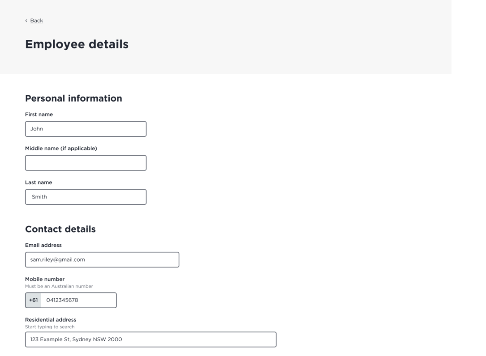
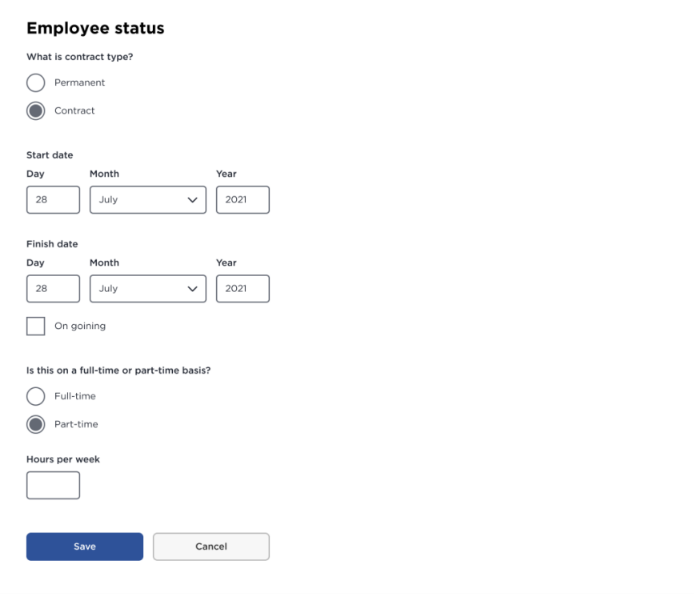

# Employee Creator

{add test badges here for test workflows: [Github Workflow Badges](https://docs.github.com/en/actions/monitoring-and-troubleshooting-workflows/adding-a-workflow-status-badge)}

[](https://github.com/carriegale2710/employee-creator/actions/workflows/main.yml)

## Introduction

### What it is:

Employee Creator is a full-stack CRUD web app built with Java Spring Boot and React TypeScript. It allows users to manage employee records (add, view, edit, delete). The project demonstrates frontend/backend integration, RESTful API design, form validation, testing, and deployment.

### Why I built it:

This project was created to practice building production-ready applications with testing, responsive UI, and scalable architecture. It also mirrors typical enterprise apps used in HR systems.

## Demo & Snippets

- [ ] Include hosted link: TBA
- [ ] Include images of app if CLI or Client App

//TODO - (replace with own finished front-end UI upon completion)

### Feature 1: Employee List

(TBA)

### Feature 2: New Employee Form

(TBA)

---

## Techstack and why

| Layer      | Technology                   | Why I chose it                      |
| ---------- | ---------------------------- | ----------------------------------- |
| Backend    | Java, Spring Boot, JPA       | Production-grade APIs, type safety  |
| DB         | MySQL, JPA                   | SQL schema control, ORM integration |
| Frontend   | React, TypeScript, Vite      | SPA structure, compile-time safety  |
| Styling    | Tailwind CSS / SCSS          | Component-level styling, responsive |
| Testing    | JUnit, Mockito, REST Assured | API + unit testing                  |
| Deployment | Heroku (TBD)                 | Easy CI/CD                          |

### Other notes:

1. Backend:

   - Java: using OOP is ideal for defining Employee classes with interfaces - can be extended upon.
   - Spring: Easier to manage dependency injection and database updates for RESTful APIs.

2. Frontend:
   - React: SPA for responsive layout
   - Typescript: validating forms for user input before being sent to DB saves time in both DX and UX.
   - SCSS/Tailwind: For modular, reusable styles and themes based on design systems.

---

## Build Steps

- how to build / run project
- use proper code snippets if there are any commands to run

```
# Clone the repo
git clone https://github.com/your-username/employee-creator.git
cd employee-creator

# Backend setup
cd backend
./mvnw spring-boot:run

# Frontend setup
cd frontend
npm install
npm run dev

```

---

## Testing

| Type       | Tools Used      | Status |
| ---------- | --------------- | ------ |
| Unit Tests | JUnit + Mockito | ✅     |
| API Tests  | REST Assured    | ✅     |
| Frontend   | Vitest / Manual | ⏳     |

```
./mvnw test      # backend
npm run test     # frontend (if added)

```

---

## Design Goals / Approach

### Overview:

- Build a full-stack app:
  - Backend: Spring Boot REST API (CRUD for employees)
  - Frontend: React + TypeScript
- Must be production-ready, testable, and deployed
- Include:

  - Basic validations
  - Responsive layout
  - Hosting (Heroku, AWS, etc.)

### QA Checklist

| Area     | Goals                                                                                                                                                                                                                                                                                           |
| -------- | ----------------------------------------------------------------------------------------------------------------------------------------------------------------------------------------------------------------------------------------------------------------------------------------------- |
| Backend: | - App compiles and runs (Spring Boot)<br>- API has 3 working CRUD endpoints (GET, POST, DELETE)<br>- Unit/e2e tests run and pass ( J-Unit, Mockito)<br>- Error handling exists<br>- Logging strategy in place ( )                                                                               |
| Frontend | - Tech-stack: React + Typescript<br>- React app compiles and runs (Vite)<br>- Create and view employee working<br>- Validation added (forms)<br>- Testing (opt) (Vitest)<br>- Form + list are styled and responsive (SCSS/Tailwind)                                                             |
| Delivery | - README includes setup steps to compile and run the API and the Web app in localhost.<br>- Hosting link works (Heroku, AWS, Azure, etc.)<br>- Code is clean and documented.<br>- Production ready.<br>- Understandable and maintainable by other developers.<br>- Bug free, compiles and work. |

### Implementation

Why did you implement this the way you did?

- Used enum for department to enforce consistency.
- Used top-down TDD to define backend before connecting to frontend.
  - Write up basic tests before coding to understand functionality, entity shapes & edge cases.
- Used Tailwind for quick responsive UI with minimal setup.

---

## Features

- What features does the project have? list them...

| ID  | Feature         | Description                            |
| --- | --------------- | -------------------------------------- |
| F1  | List Employees  | View a paginated list of all employees |
| F2  | Create Employee | Submit a form to add a new employee    |
| F3  | Delete Employee | Remove an employee from the system     |

### API Endpoints

| ID  | Method   | Endpoint         | Input             | Output Data   | Success Response |
| --- | -------- | ---------------- | ----------------- | ------------- | ---------------- |
| 1   | `GET`    | `/employees`     | none              | DB List       | `200 OK`         |
| 2   | `POST`   | `/employees`     | CreateEmployeeDTO | employee data | `201 Created`    |
| 3   | `DELETE` | `/employees/:id` | employee id       | no content    | `204 No Content` |

---

## Change logs

- Write a paragraph labelled with the date every day you work on the project to discuss what you've done for the say. Be specific about the changes that have happened for that day.

### 05/07/2025 - Backend Project Setup

- Installed SpringBoot and dependencies
- Setup application.properties file for mySQL
- Decided on SQL schema for employee database
- Defining data types for employees table in `assets/data/README.md`
- Linking to SQL and testing table database syncing

### 06/07/2025 - 07/07/2025 Testing setup

- Created simple HomeController and tested app runs in localhost:8080 browser

### In progress

- Installs dependencies for mocking + testing setup: Mockito, JSON Schema, REST Assured.

### Sprint

- Write simple sanity check test that fails if app cannot start
- write up basic tests

### Backlog

- Create Employee entity with getters and setters
- Write code for basic get method
- upload dummy data

---

## Known issues

- Remaining bugs, things that have been left unfixed
- Features that are buggy / flimsy

---

## Future Goals

- What are the immediate features you'd add given more time / ideas parking lot:
- Find employee by id
- Search Bar (find by name match)

## Learning Curves - What did you struggle with?

- What? Why? How?

---

## Licensing Details

- What type of license are you releasing this under?

---

## Related projects, reimplementations

- link client app README here later

---

## Further details/Appendix

### User Stories

| ID  | Feature           | User Wants To...   | So They Can...    | User should be able to...                                                  |
| --- | ----------------- | ------------------ | ----------------- | -------------------------------------------------------------------------- |
| 1   | `List Employees`  | See all employees  | Review records    | Click link to view a paginated list of all employee records                |
| 2   | `Create Employee` | Add a new employee | Register new hire | Click button that opens a form to add a new employee as a new record in DB |
| 3   | `Delete Employee` | Delete employee    | Remove old record | Click a button to delete a record of an existing employee in DB            |

### User Flows

\*Red borders are core MVP features


See [User Flows Mermaid Diagram](https://www.mermaidchart.com/app/projects/dc3bdcc4-0838-4954-b61e-39ed0000a222/diagrams/7ff245ec-49e3-47a7-af4d-bf5ce3f4158b/version/v0.1/edit)

### App Layers: (update later)


## Schemas

### Employee Schema

Data types for properties of Employee class.

- id : unique number (generated in backend)
- first_name : string
- last_name : string
- email : unique string (generated in backend)
- department : enum (dropdown in UI)
- startDate : Date (datepicker UI, validation needed)

### Employee List - Sample Data (GET Request)

This is what the Employee List Data should look like when fetched from API.

```json
[
  {
    "id": 1,
    "firstName": "Timmy",
    "lastName": "Turner",
    "email": "timmehhh@example.com",
    "department": "ENGINEERING",
    "startDate": "2023-01-10"
  },
  {
    "id": 2,
    "firstName": "Cosmo",
    "lastName": "Cosma",
    "email": "cosmo@example.com",
    "department": "HUMAN_RESOURCES",
    "startDate": "2020-08-15"
  },
  {
    "id": 3,
    "firstName": "Wanda",
    "lastName": "Fairywinkle",
    "email": "wanda@example.com",
    "department": "SALES",
    "startDate": "2019-04-22"
  }
]
```

### CreateEmployeeDTO Schema

This is the type of data that will be sent from the client side. Note: A unique Id & email should be generated in backend

- first_name : string
- last_name : string
- department : enum (dropdown in UI)
- startDate : Date (datepicker UI, validation needed)

Note: 🔒 "department" must be one of:
"ENGINEERING", "SALES", "HUMAN_RESOURCES", "MARKETING", "FINANCE"

### Sample Data for POST Request

```json
{
  "firstName": "Timmy",
  "lastName": "Turner",
  "email": "timmehhh@example.com",
  "department": "ENGINEERING",
  "startDate": "2023-01-10"
}
```

### SQL Schema - Database

```sql
-- Define enum type
CREATE TYPE department AS ENUM (
  'ENGINEERING',
  'SALES',
  'HUMAN_RESOURCES',
  'MARKETING',
  'FINANCE'
);

-- Table using enum
CREATE TABLE employees (
  id SERIAL PRIMARY KEY,
  first_name VARCHAR(50) NOT NULL,
  last_name VARCHAR(50) NOT NULL,
  email VARCHAR(100) UNIQUE NOT NULL,
  department department NOT NULL,
  start_date DATE NOT NULL
);
```

## Project Brief

### Purpose

Demonstrates an understanding of:

- writing RESTful APIs with basic CRUD endpoints
- building front-end UIs with React
- integration of backend + frontend code
- deployment of full-stack web applications

### MVP Requirements

[Project Brief](https://github.com/nology-tech/aus-post-course-guide/tree/main/projects/employee-creator)

- We need a web application to manage employees:
  - [ ] create
  - [ ] list
  - [ ] modify
  - [ ] delete
- The schema for the employee is left to the criteria of the candidate.

Also code should be:

- [ ] Production ready.
- [ ] Understandable and maintainable by other developers.
- [ ] Robust and handle error situations.
- [ ] Bug free, compile and work.
- [ ] Include instructions to compile and run the API and the Web app in localhost.
- [ ] Hosting (Heroku, AWS, Azure, etc.) is required.
- [ ] If your code includes unit tests you may use a unit test framework of your choice.

### Hints

#### React hints

- React Redux is recommended.
  - You may want to use a Redux middlewear like thunks or epics to handle async actions
- Typescript is recommended.
- React hooks are recommended.
- You can include any other open source NPM library.
- Feel free to use your favorite CSS framework.
  - Tailwind is a good choice
- Feel free to use your favorite middleware.
- Add some basic validations on the form like:
  - [ ] input required
  - [ ] input max length
- Reccomended:
  - [ ] React Hook Form
  - [ ] Zod are reccomended
- The site should be responsive.
  - [ ] media queries
  - [ ] flexbox

#### RESTful API hints

- The list can be a local database
  - [x] MySQL is reccomended
- Implementing an API logging strategy.
  - [ ] Log2j **highly** reccomended
- [ ] Implementing error handling strategy.
- At least 3 endpoints are required:
  - [ ] To create an employee `/create`
  - [ ] To get a list of existing employees `/list`
  - [ ] To delete an employee `delete?id={id}`

### Design Snippets (examples from brief)





### Technology / Documentation Recommendations

#### Frontend

- [ ] Vite with `react-ts`
- [ ] Use SCSS instead of CSS, `npm install sass`
  - [ ] Or just use Tailwind
- [ ] React Form Hook for form validation & submission
  - https://react-hook-form.com/get-started
- [ ] Typescript React Cheatsheet
  - https://react-typescript-cheatsheet.netlify.app/docs/basic/getting-started/basic_type_exampleReact Cheat Sheet
- [ ] React Router for routes
  - https://reactrouter.com/en/main/start/tutorial

#### Backend

- Dependencies

  - [x] Spring Web,
  - [x] Validation I/O
  - [ ] Spring Testing
    - [ ] Rest assured
    - [ ] mockito
  - [x] Spring Data JPA
  - [x] MySQL Driver
  - [x] Spring Devtools

Testing

- https://spring.io/guides/gs/testing-web/
- https://www.baeldung.com/spring-mock-rest-template

Logging

- https://www.baeldung.com/spring-boot-logging

CORS Errors

- https://www.baeldung.com/spring-cors

API Semantics

- https://www.uniprot.org/help/rest-api-headers
- https://restfulapi.net/resource-naming/

---
