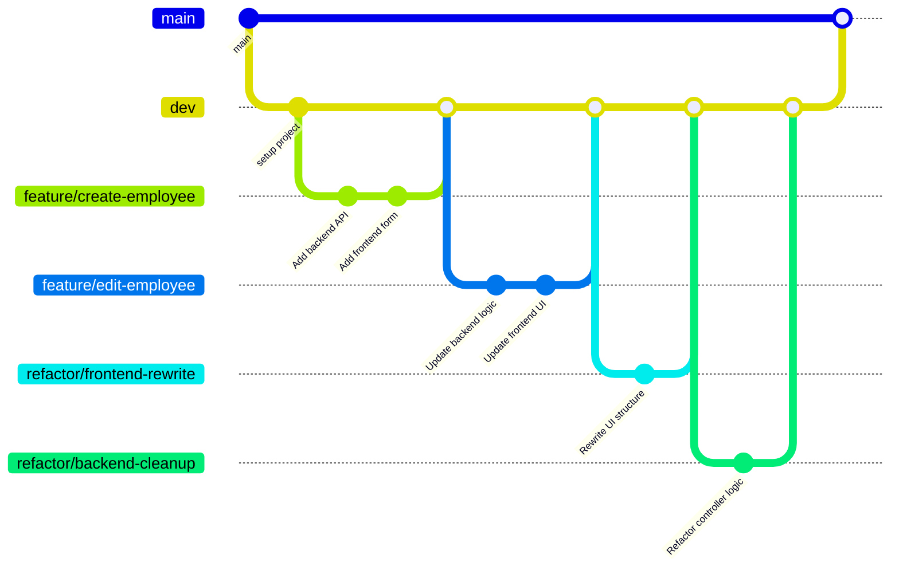

# Employee Creator Full-Stack Web Application

<!-- [](https://github.com/carriegale2710/employee-creator/actions/workflows/spring-ec2-deploy.yml) -->

[](https://github.com/carriegale2710/employee-creator/actions/workflows/spring-boot-test.yml) [](https://github.com/carriegale2710/employee-creator/actions/workflows/react-deploy.yml) [](https://opensource.org/licenses/MIT)

### Documentation - Note

This documentation for this project is split up into backend vs front-end specific locations in the code base. They include more details like build steps, testing and change logs.

| Location                                     | Purpose                                                 |
| -------------------------------------------- | ------------------------------------------------------- |
| `README.md` (this file)                      | 🔷 High-level overview of the entire full-stack project |
| [`employee/README.md`](employee/README.md)   | ⚙️ Backend-specific setup, API docs, DB, test config.   |
| [`front-end/README.md`](front-end/README.md) | 🎨 Frontend-specific setup, dev commands, tests         |

## Introduction

### What it is

Employee Creator is a full-stack CRUD web app built with Java Spring Boot and React TypeScript. It allows users to manage employee records (add, view, edit, delete). The project demonstrates frontend/backend integration, RESTful API design, form validation, testing, and deployment.

### Why I built it

This project was created to practice building production-ready applications with testing, responsive UI, and scalable architecture. It also mirrors typical enterprise apps used in HR systems.

## Demo & Snippets

<!-- - [x] Include hosted link: TBA -->

### Hosted Links:

Back-end API:
`ec2-3-107-209-102.ap-southeast-2.compute.amazonaws.com:8080/employees`

Front-end app:
`https://d3bcyx0s1yb5do.cloudfront.net/`

<!-- - [ ] Include images of app if CLI or Client App -->

<!--
//TODO - (replace with own finished front-end UI upon completion)

### Feature 1: Employee List

(TBA)

### Feature 2: New Employee Form

(TBA) -->

---

## Techstack and why

| Layer      | Technology                              | Why I chose it                      |
| ---------- | --------------------------------------- | ----------------------------------- |
| Backend    | Java, Spring Boot                       | Production-grade APIs, type safety  |
| DB         | MySQL, JPA                              | SQL schema control, ORM integration |
| Frontend   | React, TypeScript, Vite                 | SPA structure, compile-time safety  |
| Styling    | Tailwind (TBD) CSS / SCSS               | Component-level styling, responsive |
| Testing    | JUnit, Mockito, REST Assured, H2        | API e2e + unit tests, mock data     |
| Deployment | AWS EC2 (Backend API) S3 (Front-end UI) | Easy CI/CD, low costs               |

### Other notes

1. Backend:

   - Java: using OOP is ideal for defining Employee classes with interfaces - can be extended upon.
   - Spring: Easier to manage dependency injection and database updates for RESTful APIs.

2. Frontend:
   - React: SPA for responsive layout
   - Typescript: validating forms for user input before being sent to DB saves time in both DX and UX.
   - SCSS/Tailwind: For modular, reusable styles and themes based on design systems.

---

## Build Steps

<!-- - how to build / run project
- use proper code snippets if there are any commands to run -->

<!-- ## Build - Quickstart

put quickstart version here -->

Refer to 'Build Steps' instructions in these READMEs.

- [Building Backend API](employee/README.md)
- [Building Front-end UI](front-end/README.md)

## Testing

| Type       | Tools Used       | Status |
| ---------- | ---------------- | ------ |
| Unit Tests | JUnit + Mockito  | ✅     |
| E2E Tests  | REST Assured, H2 | ⏳     |
| Frontend   | Vitest / Zod     | ⏳     |

```bash
./mvnw test      # backend
npm run test     # frontend (if added)

```

---

## Design Goals / Approach

### MVP Objectives

See [Project Requirements](project-brief.md)

- Build a full-stack app:
  - Backend: Spring Boot REST API (CRUD for employees)
  - Frontend: React + TypeScript
- Must be production-ready, testable, and deployed
- Include:

  - Basic validations
  - Responsive layout
  - Hosting (Heroku, AWS, etc.)

### TDD Workflow

| Phase       | Action                                           |
| ----------- | ------------------------------------------------ |
| 🔴 Red      | Write a test for a feature you haven’t built yet |
| 🟢 Green    | Build the simplest code to pass the test         |
| 🟡 Refactor | Clean up code while keeping tests passing        |

### Production Protocol



---

<!-- ### Implementation

Why did you implement this the way you did? -->

---

## Features

<!-- | Icon | Meaning              |
| ---- | -------------------- |
| ⬜️  | To Do (not started)  |
| 🔄   | In Progress          |
| ⛔️  | Blocked / Needs Help |
| ✅   | Done (completed)     |
| 🧪   | Needs Testing        |
| 📦   | Deployed / Delivered | -->

| ID  | Feature         | Description                              | MVP? | BE  | FE  |
| --- | --------------- | ---------------------------------------- | :--: | :-: | :-: |
| F1  | List Employees  | View a paginated list of all employees   | yes  | ✅  | 🧪  |
| F2  | Create Employee | Submit a form to add a new employee      | yes  |     | 🔄  |
| F3  | Delete Employee | Remove an employee from the system       | yes  | 🔄  | 🔄  |
| F5  | View Employee   | View details of one employee in DB       |      |     |     |
| F6  | Create Contract | Add a new contract for existing employee |      |     |     |
| F7  | Edit Contract   | View details of one contract in DB       |      |     |     |

### Legend

- ✅ = Done
- 🔄 = In Progress
- 🧪 = Testing
- Blank = Not started
- **MVP** = Minimum Viable Product feature

## QA Checklist

### 🔧 Backend (Spring Boot)

- [x] App compiles and runs
- [ ] API has working CRUD endpoints (GET, CREATE, DELETE + EDIT)
- [x] Unit + end-to-end tests (JUnit, Mockito)
- [ ] Error handling implemented
- [x] Logging strategy in place

### 💻 Frontend (React + TypeScript)

- [x] React app compiles and runs (Vite)
- [ ] Basic CRUD employee functionality works
- [ ] Form validation added
- [x] Optional testing included (Vitest/Zod)
- [ ] UI styled + responsive (SCSS/Tailwind)

### 🚚 Delivery & Deployment (Both)

- [ ] README includes clear setup steps for both API and Web app (local dev)
- [ ] Hosting link works (Heroku, AWS, Azure, etc.)
- [ ] Code is clean + well documented
- [ ] App is production-ready
- [ ] Codebase is understandable and maintainable
- [ ] Bug-free and everything compiles + runs as expected

---

## Known issues

<!-- Remaining bugs, things that have been left unfixed:

Features that are buggy / flimsy/not functional yet: -->

1. Delete by employee id not working in BE.
2. Front-end app is not switching the VITE api key according to env (dev vs production mode).
3. Duplicate data (for email) posting needs to return BAD_REQUEST status code.
4. [14/07/25] Custom domain for EC2 : for fetching safely from front-end (otherwise error below)
   -> stuck at "Test out your API" : health check failing, need to look at EC2 security group setting again

5. [15/07/25] Need to audit API logging and react app fetching for any security holes

---

## Future Goals

<!-- What are the immediate features you'd add given more time / ideas parking lot: -->

- Add API Pagination (with findAll(Pageable pageable) from JpaRepository)
- Contracts: Implement a contracts table schema, with a one-to-many relationship with each employee (one employee can have many contracts)

Maybes:

- Search Bar (find by name match with query params)
- Login and authentication service/security (for admin access only) - Context API for frontend?

---

## Learning Curves + Research Questions

<!-- - What did you struggle with? What? Why? How? -->

- Setting up Github Actions was a bit tricky in terms of config. Too many commits to test it.
- Deployment was straight forward but linking up BE with FE a bit tricky with setting up AWS security settings for custom domain for EC2 server hosting

## Retrospective: Lessons + skills learnt from this project

### Practicing Test Driven Development (TDD)

- Writing E2E tests for my backend API was super helpful for understanding what exactly my features were.
- Also helped with motivation seeing green ticks.
- Better efficiency with regression testing during refactors rather than debugging in browser.

### Experimenting with more efficient, sustainable project documentation strategies (eg. change logs, mermaid diagrams).

- I have found that writing a few notes on your progress helped A LOT with project scope definition/creep. Also just better understanding what the project brief is about and thinking earlier about what potential blockers to beware of during production.
- Before I was using trello before, which was good but not as sustainable for more solo dev work (good for collaboration though). - I have found just writing mini-progress reports in a README file to be simpler and even safer way due to better version history. I don't need to worry about accidently deleting anything as I can go back to older commits.
- I can also track progress changes overtime, and refresh my brain on what I was working on the day before.
- Will continue using this method for solo projects.

## Licensing Details

<!-- What type of license are you releasing this under? -->

MIT License.

---

<!-- ## Related projects, reimplementations, misc.

### Client App UI

See related documentation for [React Client App](front-end/README.md). -->
