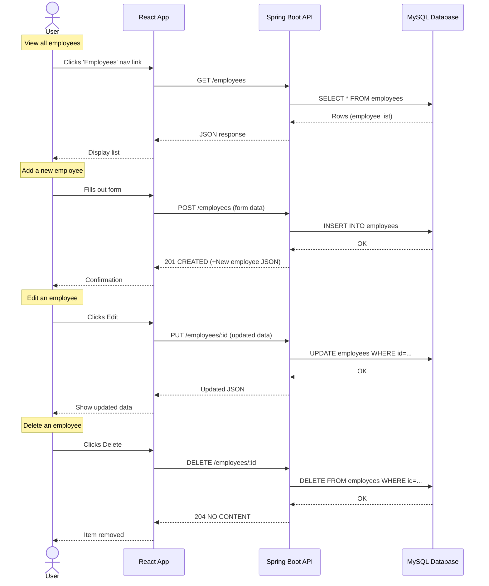

# Employee Creator

<!-- [](https://github.com/carriegale2710/employee-creator/actions/workflows/spring-ec2-deploy.yml) -->

[](https://github.com/carriegale2710/employee-creator/actions/workflows/spring-boot-test.yml) [](https://github.com/carriegale2710/employee-creator/actions/workflows/react-deploy.yml)

## Introduction

### What it is

Employee Creator is a full-stack CRUD web app built with Java Spring Boot and React TypeScript. It allows users to manage employee records (add, view, edit, delete). The project demonstrates frontend/backend integration, RESTful API design, form validation, testing, and deployment.

### Why I built it

This project was created to practice building production-ready applications with testing, responsive UI, and scalable architecture. It also mirrors typical enterprise apps used in HR systems.

## Demo & Snippets

<!-- - [x] Include hosted link: TBA -->

Hosted Links:

API:
`ec2-3-107-209-102.ap-southeast-2.compute.amazonaws.com:8080/employees`

Front-end app:
`https://d3bcyx0s1yb5do.cloudfront.net/`

<!-- - [ ] Include images of app if CLI or Client App -->

<!--
//TODO - (replace with own finished front-end UI upon completion)

### Feature 1: Employee List

(TBA)

### Feature 2: New Employee Form

(TBA) -->

---

## Techstack and why

| Layer      | Technology                       | Why I chose it                      |
| ---------- | -------------------------------- | ----------------------------------- |
| Backend    | Java, Spring Boot, JPA           | Production-grade APIs, type safety  |
| DB         | MySQL, JPA                       | SQL schema control, ORM integration |
| Frontend   | React, TypeScript, Vite          | SPA structure, compile-time safety  |
| Styling    | Tailwind (TBD) CSS / SCSS        | Component-level styling, responsive |
| Testing    | JUnit, Mockito, REST Assured, H2 | API e2e + unit tests, mock data     |
| Deployment | Heroku (TBD)                     | Easy CI/CD                          |

## Build Steps

<!-- - how to build / run project
- use proper code snippets if there are any commands to run -->

### Setup

```bash
# Clone the repo
git clone https://github.com/your-username/employee-creator.git
cd employee-creator

# Backend setup
./mvnw spring-boot:run

# Frontend setup
cd frontend
npm install
npm run dev

```

### Running the App Locally (macOS & Windows)

---

#### 🐬 1. Install MySQL

- **macOS**

  ```bash
  brew install mysql
  brew services start mysql
  ```

- **Windows**

  1. Download [MySQL Installer](https://dev.mysql.com/downloads/installer/)
  2. Install MySQL Server
  3. Make sure it's running as a service

---

#### 🛠️ 2. Create Database

Open MySQL shell:

```bash
mysql -u root -p
```

Then run:

```sql
CREATE DATABASE your_database_name;
```

> ✅ **Skip user creation if you're using `root` for local dev**
> Otherwise:
>
> ```sql
> CREATE USER 'your_user'@'localhost' IDENTIFIED BY 'your_password';
> GRANT ALL PRIVILEGES ON your_database_name.* TO 'your_user'@'localhost';
> FLUSH PRIVILEGES;
> ```

---

#### 📄 3. Add `.env` File

Create a `.env` file in the project root:

```env
DB_NAME=your_database_name
MYSQL_USER=your_user_or_root
MYSQL_PASS=your_password
```

---

#### 🧯 4. Fix Socket Errors [macOS Only]

If you get MySQL socket errors on Mac, force TCP:

```properties
spring.datasource.url=jdbc:mysql://127.0.0.1:3306/${DB_NAME}
```

---

#### ▶️ 5. Run the App

```bash
./mvnw spring-boot:run
```

Or use your IDE (IntelliJ, VSCode, etc.)

---

### Endpoints:

Once running, your API will be available at:

```
http://localhost:8080
```

Opening this in your browser should return "Hello, world".
Use [Postman](https://www.postman.com/downloads/) or a browser (for GET requests) to test.

- **GET all employees:**
  `http://localhost:8080/api/employees`

- **GET single employee:**
  `http://localhost:8080/api/employees/{id}`

- **POST new employee:**

  - Method: `POST`
  - URL: `http://localhost:8080/api/employees`
  - Body (JSON):

    ```json
    {
      "firstName": "Timmy",
      "lastName": "Turner",
      "email": "timmy@fairy.com"
    }
    ```

---

## Testing

| Type       | Tools Used       | Status |
| ---------- | ---------------- | ------ |
| Unit Tests | JUnit + Mockito  | ✅     |
| E2E Tests  | REST Assured, H2 | ⏳     |
| Frontend   | Vitest / Zod     | ⏳     |

```bash
./mvnw test      # backend
npm run test     # frontend (if added)

```

---

## Design Goals / Approach

#### MVP Objectives

See [Project Requirements](project-brief.md)

- Build a full-stack app:
  - Backend: Spring Boot REST API (CRUD for employees)
  - Frontend: React + TypeScript
- Must be production-ready, testable, and deployed
- Include:

  - Basic validations
  - Responsive layout
  - Hosting (Heroku, AWS, etc.)

#### User Stories to fufill

| ID  | Feature           | User Wants To...   | So They Can...    | User should be able to...                                                  |
| --- | ----------------- | ------------------ | ----------------- | -------------------------------------------------------------------------- |
| 1   | `List Employees`  | See all employees  | Review records    | Click link to view a paginated list of all employee records                |
| 2   | `Create Employee` | Add a new employee | Register new hire | Click button that opens a form to add a new employee as a new record in DB |
| 3   | `Delete Employee` | Delete employee    | Remove old record | Click a button to delete a record of an existing employee in DB            |

### Implementation

<!-- Why did you implement this the way you did? -->

<!-- - Used enum for department to enforce consistency.
- Used Tailwind for quick responsive UI with minimal setup. -->

- Used top-down TDD to define backend before connecting to frontend.
- Write up basic tests before coding to understand functionality, entity shapes & edge cases.

#### Entity Relationship Diagram (ERD)

- Included a contracts and departments table with a `one-to-many relationship` for `employees -> contracts` and `departments -> contracts`
- This allows for flexible, quicker UX when editing of DB records via in FE client app with only minor updates eg. salary, contract dates etc.


See more in [Schemas](assets/data/README.md)

## Features

| ID  | Feature         | Description                            |
| --- | --------------- | -------------------------------------- |
| F1  | List Employees  | View a paginated list of all employees |
| F2  | Create Employee | Submit a form to add a new employee    |
| F3  | Delete Employee | Remove an employee from the system     |
| F4  | View Employee   | View details of one employee in DB     |

### API Endpoints

| ID  | Method   | Endpoint         | Input             | Output Data | Success Response |
| --- | -------- | ---------------- | ----------------- | ----------- | ---------------- |
| 1   | `GET`    | `/employees`     | none              | DB List     | `200 OK`         |
| 2   | `POST`   | `/employees`     | CreateEmployeeDTO | DB Record   | `201 Created`    |
| 3   | `DELETE` | `/employees/:id` | employee id       | No Content  | `204 No Content` |
| 1   | `GET`    | `/employees/:id` | employee id       | DB Record   | `200 OK`         |

### Sequence Diagram



[Sequence Diagram](assets/diagrams/sequence-diagram.md)

---

## Known issues

<!-- Remaining bugs, things that have been left unfixed:

Features that are buggy / flimsy/not functional yet: -->

1. Delete by employee id not working in BE.
2. Front-end app is not switching the VITE api key according to env (dev vs production mode).
3. Duplicate data (for email) posting needs to return BAD_REQUEST status code.
4. [14/07/25] Custom domain for EC2 : for fetching safely from front-end (otherwise error below)
   -> stuck at "Test out your API" : health check failing, need to look at EC2 security group setting again


5. [15/07/25] Need to audit API logging and react app fetching for any security holes

---

## Future Goals

<!-- What are the immediate features you'd add given more time / ideas parking lot: -->

- Add API Pagination (with findAll(Pageable pageable) from JpaRepository)
- Contracts: Implement a contracts table schema, with a one-to-many relationship with each employee (one employee can have many contracts)

Maybes:

- Search Bar (find by name match with query params)
- Login and authentication service/security (for admin access only) - Context API for frontend?

---

## Learning Curves + Research Questions

<!-- - What did you struggle with? What? Why? How? -->

- Setting up Github Actions was a bit tricky in terms of config. Too many commits to test it.
- Deployment was straight forward but linking up BE with FE a bit tricky with setting up AWS security settings for custom domain for EC2 server hosting

---

## Lessons + skills learnt

- TDD + documentation helps with immensely with project scope definition/creep
- How to deploy both FE and BE with AWS

---

## Licensing Details

<!-- What type of license are you releasing this under? -->

MIT License.

---

## Related projects, reimplementations

See related documentation for [React Client App](front-end/README.md).
