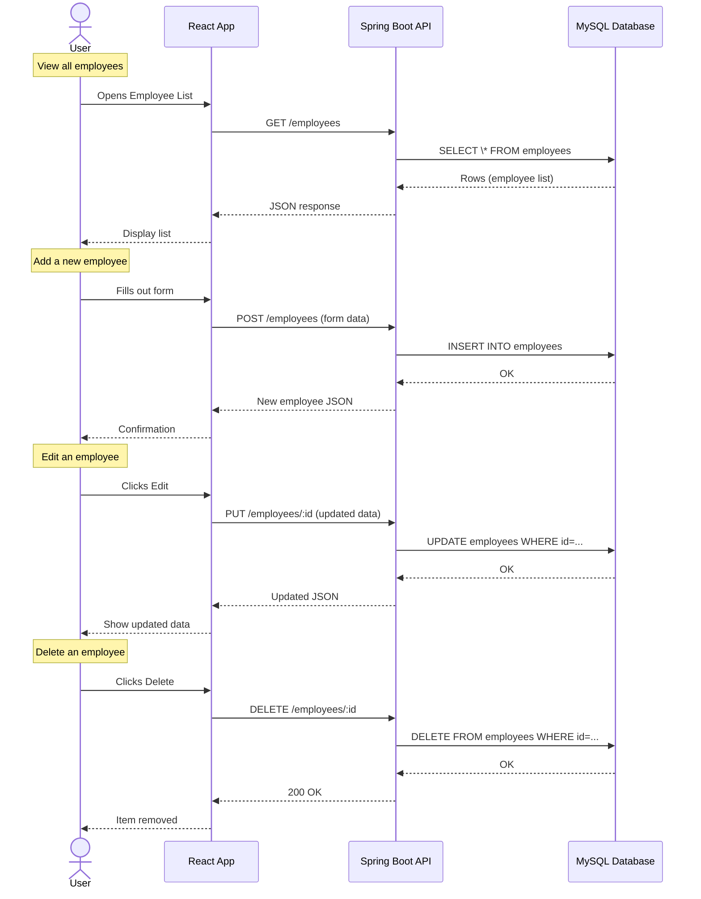

# Employee Creator Spring API + React App

> A production-ready HR management system built with Java Spring Boot and React TypeScript

**Live Demo**: [Employee Creator App](https://employeecreator.site/) | **⚡ API**: [employeecreator.my](https://api.employeecreator.site)

## [](https://github.com/carriegale2710/employee-creator/actions/workflows/spring-boot-test.yml) [](https://github.com/carriegale2710/employee-creator/actions/workflows/react-deploy.yml) [](https://opensource.org/licenses/MIT)

## Table of Contents

- [Project Overview](#project-overview)
- [Project Retrospective](#project-retrospective)
- [Live Demo & API](#live-demo--api)
- [Quick Start](#quick-start)
- [Testing](#testing)
- [Tech Stack](#tech-stack)
- [Design Decisions](#design-decisions)
- [Known Issues](#known-issues)
- [Future Goals](#future-goals)
- [Project Structure](#project-structure)
- [Licensing Details](#licensing-details)

---

## Project Overview

**Employee Creator** is a full-stack CRUD application for managing employee records and contracts. Built over 4 weeks as a solo project, it demonstrates enterprise-level development practices including comprehensive testing, CI/CD deployment, and scalable architecture.

### Who this app is for:

1. **For HR Teams**: Streamline employee onboarding, track contract history, maintain compliance records

2. **For Developers**: Reference implementation showcasing modern full-stack patterns, testing strategies, and deployment practices

3. **For Stakeholders**: Production-ready system with scalable architecture and comprehensive audit trails

### Highlights

- **Full-Stack**: Java Spring Boot API + React TypeScript frontend
- **Comprehensive Testing**: 40+ automated tests (Unit, Integration, E2E)
- **Production Deployed**: AWS infrastructure with automated CI/CD
- **Enterprise Features**: Employee management, contract tracking, form validation
- **Modern Stack**: TypeScript, Tailwind CSS, MySQL, GitHub Actions

---

## Key Features

#### :man_office_worker: Employee Management

- **View All Employees** - Paginated list with search and filter capabilities
- **Employee Profiles** - Detailed view showing personal info, contracts, and actions
- **Add Employee** - Registration form with validation and confirmation
- **Edit Employee** - Update existing employee information
- **Delete Employee** - Remove employee with confirmation dialog

#### 📄 Contract Management

- **View All Contracts** - Paginated list with employee filtering
- **Create Contract** - Link new contracts to existing employees
- **Employee Contracts** - View all contracts for a specific employee
- **Delete Contract** - Remove contracts with proper authorization (WIP)

> **Note:** Each employee can have multiple contracts. Contracts are treated as immutable legal documents with no update functionality by design.

---

## Design Decisions

### Backend

- Used top-down TDD to define backend features and to run within CI/CD pipeline.
- Included a contracts with a `one-to-many relationship` for `employees -> contracts`
- This allows for flexible, quicker UX when updating of DB records via in FE client app with only minor updates eg. salary, contract dates etc.
- Separated concerns by having a dedicated contracts table, allowing for better organization and management + security of employee contracts.

### Front-end

- Used React Router for seamless navigation between views.
- Implemented form validation using React Hook Form for schema validation.
- Used Vitest for minimal component testing to ensure UI functionality.
- Implemented a responsive design using Tailwind CSS and SCSS for component-level styling.

---

## Skills and Lessons Learned

This project was a solo endeavor to build a full-stack web application that simulates real-world business scenarios. It aimed to apply best practices in software development, including:

- **Microservices architecture** thinking
- **Separation of concerns** principle
- **Production deployment** patterns
- **Documentation** and changelog management

### Key Challenges of this project

| **Area**                   | **Skills Gained**                                                                     | **Key Challenge**                       | **Solution & Learning**                                                                        |
| -------------------------- | ------------------------------------------------------------------------------------- | --------------------------------------- | ---------------------------------------------------------------------------------------------- |
| **Full-Stack Development** | Frontend/backend integration, API design, CORS handling, state management             | AWS backend/frontend integration issues | Resolved with proper CORS configuration and security group adjustments                         |
| **Testing Strategy**       | TDD methodology, unit/integration testing, balancing coverage with delivery speed     | Balancing TDD with delivery speed       | Hybrid approach: browser testing first, then writing tests worked better for solo projects     |
| **DevOps & Deployment**    | AWS deployment (EC2, S3, CloudFront), GitHub Actions CI/CD, production configurations | GitHub Actions configuration complexity | Multiple iterations needed - learned to test pipeline changes incrementally                    |
| **Code Quality**           | Git workflows, branching strategies, code review processes, clean commit histories    | Simulating team development practices   | Used `main` + `dev` branches with feature branching and advanced Git commands (rebase, squash) |
| **Architecture**           | Microservices thinking, separation of concerns, scalable application structure        | Managing monorepo documentation         | Split by domain (frontend/backend) with regular changelog updates for better maintainability   |

---

## Live Demo & API

- **Frontend:** [Live Demo](https://employeecreator.site/)
- **Backend API:** [Raw API](https://api.employeecreator.site/)

> Live backend API is deployed on AWS EC2. The frontend React app is deployed separately on S3 + CloudFront, and communicates with this backend via HTTPS.

| Layer                 | Service                                     | Domain                     |
| --------------------- | ------------------------------------------- | -------------------------- |
| Frontend (React)      | S3 static site behind CloudFront            | `employeecreator.site`     |
| Backend (Spring Boot) | EC2 (Nginx reverse proxy → systemd service) | `api.employeecreator.site` |
| Database              | MySQL, local to the EC2 instance            | —                          |

---

## Quick Start

### Prerequisites

- Java 17+
- Node.js 18+
- MySQL 8.0+

### Backend (Spring Boot)

```bash
cd employee
./mvnw clean install
./mvnw spring-boot:run
# API available at: http://localhost:8080
```

### Frontend (React)

```bash
cd front-end
npm install
npm run dev
# App available at: http://localhost:5173
```

### Detailed Setup

For comprehensive setup instructions including environment configuration, database setup, and deployment:

- [Building Backend API](employee/README.md)
- [Building Front-end UI](front-end/README.md)

---

## Testing

| Type                  | Tools Used       | Implementation               |
| --------------------- | ---------------- | ---------------------------- |
| Spring Unit Tests     | JUnit + Mockito  | ✅ Service Layers            |
| Spring E2E Tests      | REST Assured, H2 | ✅ 40+ employees / contracts |
| React Component Tests | Vitest           | ⏳ Basic                     |

To run tests, use the following commands:

```bash
./mvnw test      # backend
npm run test     # frontend (if added)

```

---

## Tech Stack

| Layer      | Technology                                             | Purpose                             |
| ---------- | ------------------------------------------------------ | ----------------------------------- |
| DB         | MySQL, JPA                                             | SQL schema control, ORM integration |
| Backend    | Spring Boot, Java, Maven                               | Production-grade APIs, type safety  |
| Frontend   | React, TypeScript, Vite                                | SPA structure, compile-time safety  |
| Testing    | JUnit, Mockito, REST Assured, H2, Faker (Data seeding) | API e2e + unit tests, mock data     |
| Styling    | Tailwind / SCSS                                        | Component-level styling, responsive |
| Deployment | AWS EC2 (Backend API) S3 + CloudFront(Front-end UI)    | Easy CI/CD, low costs               |
| CI/CD      | GitHub Actions                                         | Automated testing and deployment    |
| Monitoring | Log24j                                                 | Logs, error tracking                |

---

## Database Design

- **TDD approach**: Tests written before implementation
- **Entity separation**: Employees vs Contracts for better organization
- **One-to-Many relationship**: Supports contract history tracking
- **Immutable contracts**: No update operations by design

**Employees** (1) → **Contracts** (Many)

Each employee can have multiple contracts over time. Contracts are immutable legal documents.


## Sequence Diagram of Core Flow


```mermaid
---

config:
theme: redux-dark-color

---

sequenceDiagram
actor User
participant ReactApp as React App
participant SpringAPI as Spring Boot API
participant MySQL as MySQL Database
Note over User: View all employees
User->>ReactApp: Opens Employee List
ReactApp->>SpringAPI: GET /employees
SpringAPI->>MySQL: SELECT \* FROM employees
MySQL-->>SpringAPI: Rows (employee list)
SpringAPI-->>ReactApp: JSON response
ReactApp-->>User: Display list
Note over User: Add a new employee
User->>ReactApp: Fills out form
ReactApp->>SpringAPI: POST /employees (form data)
SpringAPI->>MySQL: INSERT INTO employees
MySQL-->>SpringAPI: OK
SpringAPI-->>ReactApp: New employee JSON
ReactApp-->>User: Confirmation
Note over User: Edit an employee
User->>ReactApp: Clicks Edit
ReactApp->>SpringAPI: PUT /employees/:id (updated data)
SpringAPI->>MySQL: UPDATE employees WHERE id=...
MySQL-->>SpringAPI: OK
SpringAPI-->>ReactApp: Updated JSON
ReactApp-->>User: Show updated data
Note over User: Delete an employee
User->>ReactApp: Clicks Delete
ReactApp->>SpringAPI: DELETE /employees/:id
SpringAPI->>MySQL: DELETE FROM employees WHERE id=...
MySQL-->>SpringAPI: OK
SpringAPI-->>ReactApp: 200 OK
ReactApp-->>User: Item removed
```

---

## Known issues

<!-- Remaining bugs, things that have been left unfixed:

Features that are buggy / flimsy/not functional yet: -->

- [5/08/25] Contract deletion is not fully implemented yet in front-end (WIP)
- [4/08/25] Pagination needed for employee list to reduce API load times and improve UX
- [4/08/25] Contract form should not have employee ID field - this is a UX issue (risk of human error)
- [25/07/25] React unit tests are still WIP
- [02/08/2026] Employee list does not refresh immediately after deleting an employee (needs a refresh to see changes)

## Future Goals

- Advanced search and filtering for employee list
- Contract draft management system
- Department management module
- Enhanced form confirmation steps

---

## Project Structure

> Note: The documentation for this project is split up into backend vs front-end specific locations in the code base. They include more details like build steps, testing and change logs.

See [`employee/README.md`](employee/README.md)
See [`front-end/README.md`](front-end/README.md)

```markdown
📁 employee-creator/
├── 📄 README.md (high-level overview) //you are here
├── 📁 employee/
│   ├── 📄 README.md (backend-specific)
│   └── 📄 CHANGELOG.md (backend changes)
└── 📁 front-end/
    ├── 📄 README.md (frontend-specific)
    └── 📄 CHANGELOG.md (frontend changes)
```

---

## Licensing Details

<!-- What type of license are you releasing this under? -->

MIT License.

---
