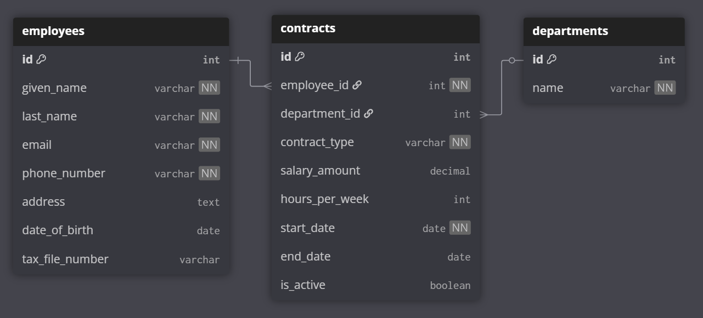

# Database structure

## Entity Relationship Diagram (ERD)



```sql
- Use DBML to define your database structure
- Docs: https://dbml.dbdiagram.io/docs

Table employees {
  id int [pk, increment] --generated
  given_name varchar [not null] -- first + middle names (up to 5)
  last_name varchar [not null]
  email varchar [unique, not null] -- can be auto-generated based on name
  phone_number varchar [not null] -- should be verified somehow
  address text -- searchable or custom entry
  date_of_birth date --verify not in future, date picker
  tax_file_number varchar [unique] -- security encryption needed
}

-- [Employee → One-to-Many → Contracts]

Table contracts {
  id int [pk, increment] --generated
  employee_id int [not null, ref: > employees.id]
  department_id int [ref: > departments.id]
  contract_type varchar [not null] // e.g., full-time, part-time
  salary_amount decimal
  hours_per_week int -- limit to 40 (exclude overtime)
  start_date date [not null]
  end_date date -- optional if not yet decided
  is_active boolean -- on by default unless past end_date
}

-- [Department → One-to-Many → Contracts]

Table departments {
  id int [pk, increment]
  name varchar [unique, not null]
  num_of_employees int -- count num of employees in this department with active contracts
}

```

### Summary

| What                       | Relationship            | Why we did this                                                    |
| -------------------------- | ----------------------- | ------------------------------------------------------------------ |
| **Employees table**        | Has personal info only  | Department can change → so not stored here                         |
| **Contracts table**        | Has job info per period | Stores department, salary, hours, type, dates for each role/period |
| **Departments table**      | Lookup table            | Keeps department names unique and consistent                       |
| **Employee → Contracts**   | One-to-Many             | - Each employee can have multiple contracts over time              |
| **Department → Contracts** | One-to-Many             | Each contract is tied to one department at that time               |

<!-- - In `Employee`:`@OneToMany(mappedBy = "employee")`
- In `Contract`:`@ManyToOne`
- In `Contract`:`@ManyToOne`
- In `Department`:`@OneToMany(mappedBy = "department")` (optional) -->

---

## Schemas

### Employee Schema

Basic employee personal data — no department or job info here (now handled via `contracts` and `departments`).

```ts
interface Employee {
  id: number;
  firstName: string;
  lastName: string;
  email: string;
  phoneNumber?: string;
  address?: string;
  dateOfBirth?: string; // ISO date string
  taxFileNumber: string;
}
```

```json
{
  "id": 1,
  "firstName": "Timmy",
  "lastName": "Turner",
  "email": "timmehhh@example.com",
  "phoneNumber": "0400000000",
  "address": "123 Fairy Lane",
  "dateOfBirth": "2000-01-01",
  "taxFileNumber": "123456789"
}
```

---

### Contract Schema

Each employee can have multiple contracts across different time periods and departments.

```ts
interface Contract {
  id: number;
  employeeId: number;
  departmentId?: number;
  contractType: "FULL_TIME" | "PART_TIME";
  salaryAmount?: number;
  hoursPerWeek?: number;
  startDate: string; // ISO date string
  endDate?: string; // ISO date string or null
  isActive: boolean;
}
```

```json
{
  "id": 101,
  "employeeId": 1,
  "departmentId": 1,
  "contractType": "FULL_TIME",
  "salaryAmount": 80000,
  "hoursPerWeek": 38,
  "startDate": "2023-01-10",
  "endDate": null,
  "isActive": true
}
```

---

### Department Schema

Lookup table to keep departments consistent but flexible to be updated later.

```ts
interface Department {
  id: number;
  name: "ENGINEERING" | "SALES" | "HUMAN_RESOURCES" | "MARKETING" | "FINANCE";
}
```

JSON HTTP 'PUT' Request:

```json
{
  "id": 1, //not needed if "POST" request (creation)
  "name": "ENGINEERING"
}
```

---

## Sample Employee List Response (GET `/employees`)

Joining the employee with their current contract and department for display.

- Can clean up HTTP response to exclude sensitive information for security.

JSON HTTP Response:

```json
[
  {
    "id": 1,
    "firstName": "Timmy",
    "lastName": "Turner",
    "email": "timmehhh@example.com",
    "currentContract": {
      //virtual field
      "contractType": "FULL_TIME",
      "startDate": "2023-01-10",
      "department": "ENGINEERING"
    }
  },
  {
    "id": 2,
    "firstName": "Cosmo",
    "lastName": "Cosma",
    "email": "cosmo@example.com",
    "currentContract": {
      //virtual field
      "contractType": "PART_TIME",
      "startDate": "2022-04-12",
      "department": "HUMAN_RESOURCES"
    }
  }
]
```

---

## DTO Schemas

### CreateEmployeeDTO + CreateContractDTO (opt.)

When creating a new employee with an option for initial contract:

```ts
interface CreateEmployeeDTO {
  firstName: string;
  lastName: string;
  // email: string; get backend to generate
  phoneNumber: string;
  address?: string;
  dateOfBirth?: string; // ISO string
  taxFileNumber?: string;
  contract?: ContractDTO; //opt.
}
interface CreateContractDTO {
  departmentId: number; //get this from name
  contractType: "FULL_TIME" | "PART_TIME";
  startDate: string; // ISO date string
  salaryAmount?: number;
  hoursPerWeek?: number;
}
```

AS `POST` HTTP request (JSON):

```json
{
  "firstName": "Timmy",
  "lastName": "Turner",
  "email": "timmehhh@example.com",
  "phoneNumber": "0400000000",
  "currentContract": {
    "contractType": "FULL_TIME",
    "startDate": "2023-01-10",
    "department": "ENGINEERING"
  }
}
```

### EditEmployeeDTO

When editing personal details of existing employee.

- As `POST` HTTP request to update only email (JSON):

```json
{
  "employee_id": 11, //required
  "email": "timmy_turner@example.com"
}
```

### EditContractDTO

When editing personal details of existing contract.

- As `POST` HTTP request to update only salary in employee's contract (JSON):

```json
{
  "employee_id": 11, //required
  "contract_id": 101, //required
  "salaryAmount": 85000
}
```
