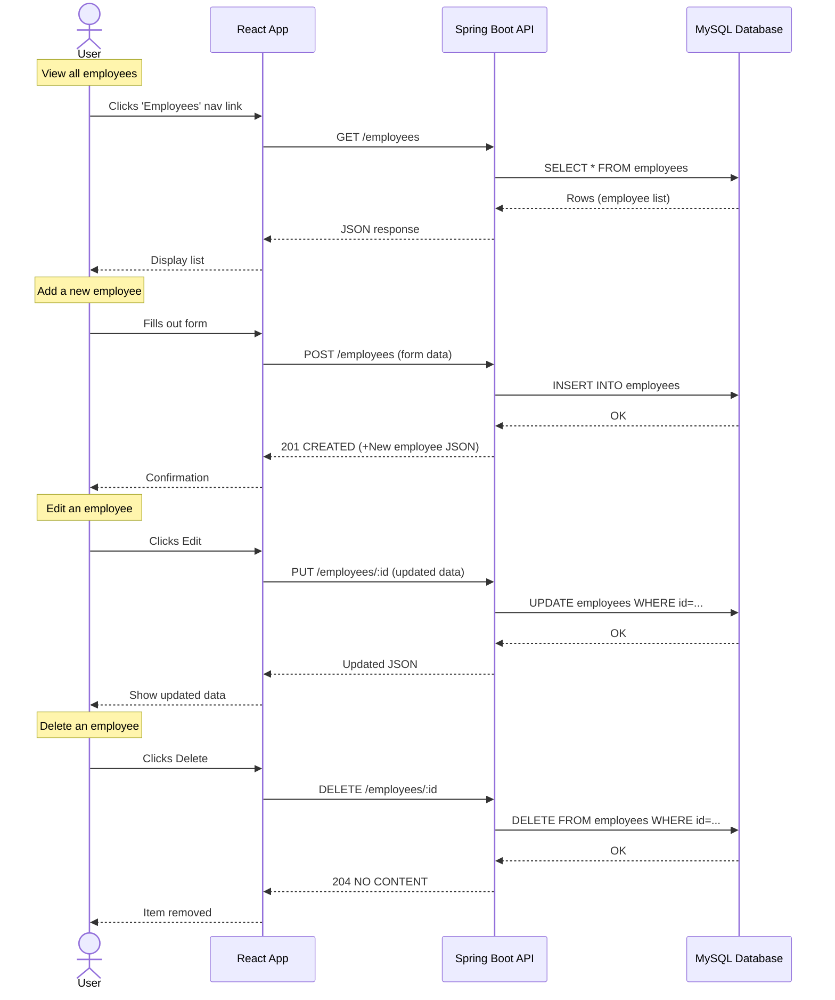

```mermaid

sequenceDiagram
  actor User
  participant ReactApp as React App
  participant SpringAPI as Spring Boot API
  participant MySQL as MySQL Database

  Note over User: View all employees
  User->>ReactApp: Clicks 'Employees' nav link
  ReactApp->>SpringAPI: GET /employees
  SpringAPI->>MySQL: SELECT * FROM employees
  MySQL-->>SpringAPI: Rows (employee list)
  SpringAPI-->>ReactApp: JSON response
  ReactApp-->>User: Display list

  Note over User: Add a new employee
  User->>ReactApp: Fills out form
  ReactApp->>SpringAPI: POST /employees (form data)
  SpringAPI->>MySQL: INSERT INTO employees
  MySQL-->>SpringAPI: OK
  SpringAPI-->>ReactApp: 201 CREATED (+New employee JSON)
  ReactApp-->>User: Confirmation

  Note over User: Edit an employee
  User->>ReactApp: Clicks Edit
  ReactApp->>SpringAPI: PUT /employees/:id (updated data)
  SpringAPI->>MySQL: UPDATE employees WHERE id=...
  MySQL-->>SpringAPI: OK
  SpringAPI-->>ReactApp: Updated JSON
  ReactApp-->>User: Show updated data

  Note over User: Delete an employee
  User->>ReactApp: Clicks Delete
  ReactApp->>SpringAPI: DELETE /employees/:id
  SpringAPI->>MySQL: DELETE FROM employees WHERE id=...
  MySQL-->>SpringAPI: OK
  SpringAPI-->>ReactApp: 204 NO CONTENT
  ReactApp-->>User: Item removed

```
