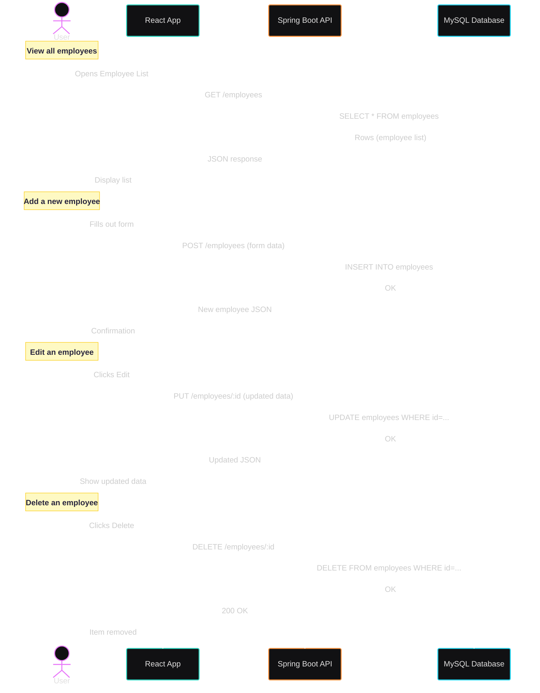

# Sequence Diagram

```mermaid

---
config:
  theme: redux-dark-color
---
sequenceDiagram
  actor User
  participant ReactApp as React App
  participant SpringAPI as Spring Boot API
  participant MySQL as MySQL Database
  Note over User: View all employees
  User->>ReactApp: Opens Employee List
  ReactApp->>SpringAPI: GET /employees
  SpringAPI->>MySQL: SELECT * FROM employees
  MySQL-->>SpringAPI: Rows (employee list)
  SpringAPI-->>ReactApp: JSON response
  ReactApp-->>User: Display list
  Note over User: Add a new employee
  User->>ReactApp: Fills out form
  ReactApp->>SpringAPI: POST /employees (form data)
  SpringAPI->>MySQL: INSERT INTO employees
  MySQL-->>SpringAPI: OK
  SpringAPI-->>ReactApp: New employee JSON
  ReactApp-->>User: Confirmation
  Note over User: Edit an employee
  User->>ReactApp: Clicks Edit
  ReactApp->>SpringAPI: PUT /employees/:id (updated data)
  SpringAPI->>MySQL: UPDATE employees WHERE id=...
  MySQL-->>SpringAPI: OK
  SpringAPI-->>ReactApp: Updated JSON
  ReactApp-->>User: Show updated data
  Note over User: Delete an employee
  User->>ReactApp: Clicks Delete
  ReactApp->>SpringAPI: DELETE /employees/:id
  SpringAPI->>MySQL: DELETE FROM employees WHERE id=...
  MySQL-->>SpringAPI: OK
  SpringAPI-->>ReactApp: 200 OK
  ReactApp-->>User: Item removed


```
