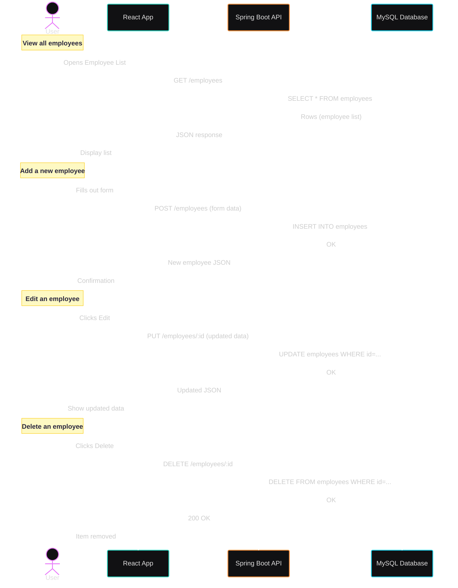

# Backend - Spring Boot API

[](https://github.com/carriegale2710/employee-creator/actions/workflows/spring-boot-test.yml) [](https://opensource.org/licenses/MIT)

## Quick Setup

```bash
cd employee
./mvnw clean install
./mvnw spring-boot:run  # http://localhost:8080
```

## Database Setup

### Install MySQL

**macOS:**

```bash
brew install mysql
brew services start mysql
```

**Windows:** Download [MySQL Installer](https://dev.mysql.com/downloads/installer/)

### Configure Database

```bash
mysql -u root -p
```

```sql
CREATE DATABASE your_database_name;
```

### Environment Variables

Create `.env` file:

```env
DB_NAME=your_database_name
MYSQL_USER=your_user_or_root
MYSQL_PASS=your_password
```

## Testing

| Type       | Tools Used       | Status |
| ---------- | ---------------- | ------ |
| Unit Tests | JUnit + Mockito  | ✅     |
| E2E Tests  | REST Assured, H2 | ✅     |

```bash
./mvnw test  # JUnit + Mockito + REST Assured
```

## API Endpoints

### Employees

- `GET /employees` - List all employees
- `GET /employees/{id}` - Get employee by ID
- `POST /employees` - Create employee

  - Example Body (JSON):

    ```json
    {
      "firstName": "Timmy",
      "lastName": "Turner",
      "email": "timmy.turner@example.com",
      "phone": "0400000000",
      "address": "123 Fairy Lane" //opt
    }
    ```

- `PATCH /employees/{id}` - Update employee

  - Example Body (JSON):

    ```json
    {
      "employeeId": 15,
      "department": "SALES",
      "contractType": "FULL_TIME",
      "salaryAmount": 80000,
      "hoursPerWeek": 38,
      "startDate": "2023-01-10",
      "endDate": null //opt
    }
    ```

- `DELETE /employees/{id}` - Delete employee

### Contracts

- `GET /contracts` - List all contracts
- `GET /contracts/{id}` - Get contract by ID
- `POST /contracts` - Create contract
- `DELETE /contracts/{id}` - Delete contract

## Database Schema

**Employees** (1) → **Contracts** (Many)

Each employee can have multiple contracts over time. Contracts are immutable legal documents.


## Tech Details

- **Spring Boot 3** + **Java 21** for enterprise-grade APIs
- **MySQL** + **JPA** for data persistence
- **JUnit 5** + **Mockito** for unit testing
- **REST Assured** + **H2** for integration testing
- **Maven** for dependency management
- **Log4j2** for application logging

## Architecture Notes

- **TDD approach**: Tests written before implementation
- **Entity separation**: Employees vs Contracts for better organization
- **One-to-Many relationship**: Supports contract history tracking
- **Immutable contracts**: No update operations by design

## Related projects, reimplementations, assets

For full project overview, see [main README](../README.md).

### Client App UI

See related documentation for [React Client App](../front-end/README.md).

### Change Log

For detailed development history and feature updates, see [CHANGELOG.md](CHANGELOG.md).

## Sequence Diagram


