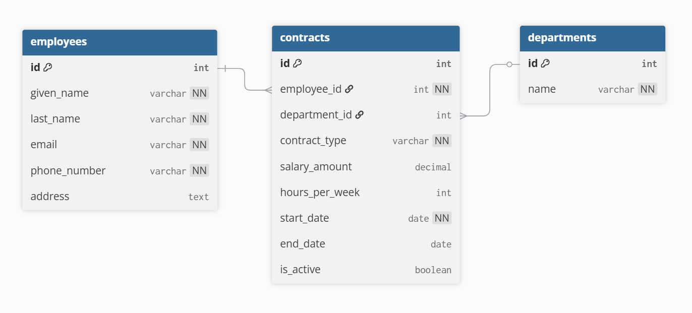
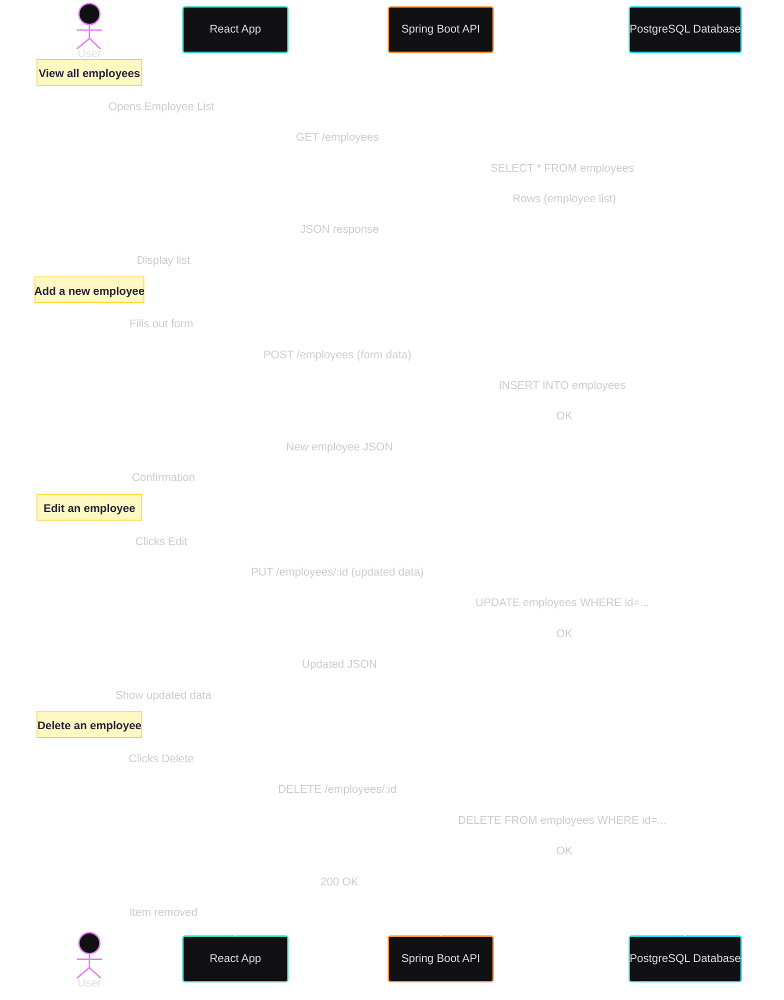

# Backend - Spring Boot API

[](https://github.com/carriegale2710/employee-creator/actions/workflows/spring-boot-test.yml) [](https://opensource.org/licenses/MIT)

## Table of Contents

- [Deployment](#deployment)
- [Quick Setup](#quick-setup)
- [Database Setup](#database-setup)
- [Testing](#testing)
- [API Endpoints](#api-endpoints)
- [Database Schema](#database-schema)
- [Tech Details](#tech-details)
- [Architecture Notes](#architecture-notes)
- [Related projects, reimplementations, assets](#related-projects-reimplementations-assets)
- [Sequence Diagram](#sequence-diagram)

## Tech Stack

- **Spring Boot 3** + **Java 21** for enterprise-grade APIs
- **PostgreSQL** + **JPA** for data persistence
- **JUnit 5** + **Mockito** for unit testing
- **REST Assured** + **H2** for integration testing
- **Maven** for dependency management
- **Log4j2** for application logging

## Quick Setup

```bash
cd employee
./mvnw clean install
./mvnw spring-boot:run  # http://localhost:8080
```

## Database Setup

### Install PostgreSQL

**macOS:**

```bash
brew install postgresql
brew services start postgresql
```

**Windows:** Download [PostgreSQL](https://www.postgresql.org/download/windows/)

### Configure Database

```bash
psql -U postgres
```

```sql
CREATE DATABASE your_database_name;
```

### Environment Variables

Create `.env` file:

```env
DB_HOST=localhost
DB_PORT=5432
DB_NAME=your_database_name
POSTGRES_USER=your_user
POSTGRES_PASSWORD=your_password
```

## Testing

| Type       | Tools Used       | Status |
| ---------- | ---------------- | ------ |
| Unit Tests | JUnit + Mockito  | ✅     |
| E2E Tests  | REST Assured, H2 | ✅     |

```bash
./mvnw test  # JUnit + Mockito + REST Assured
```

## API Endpoints

### Employees

- `GET /employees` - List all employees
- `GET /employees/{id}` - Get employee by ID
- `POST /employees` - Create employee
  - Example Body (JSON):

    ```json
    {
      "firstName": "Timmy",
      "lastName": "Turner",
      "email": "timmy.turner@example.com",
      "phone": "0400000000",
      "address": "123 Fairy Lane" //opt
    }
    ```

- `PATCH /employees/{id}` - Update employee
  - Example Body (JSON):

    ```json
    {
      "employeeId": 15,
      "department": "SALES",
      "contractType": "FULL_TIME",
      "salaryAmount": 80000,
      "hoursPerWeek": 38,
      "startDate": "2023-01-10",
      "endDate": null //opt
    }
    ```

- `DELETE /employees/{id}` - Delete employee

### Contracts

- `GET /contracts` - List all contracts
- `GET /contracts/{id}` - Get contract by ID
- `POST /contracts` - Create contract
- `DELETE /contracts/{id}` - Delete contract

## Deployment

> Live API Demo: [https://api.employeecreator.site](https://api.employeecreator.site)

Deployed on an EC2 instance (Ubuntu), running behind Nginx as a reverse proxy.

**Stack**

- Packaged as an executable jar, run via `systemd` (`employee-creator.service`)
- Listens locally on `127.0.0.1:8002`
- Nginx reverse-proxies `api.employeecreator.site` → the app, with TLS via Let's Encrypt/Certbot
- Database: PostgreSQL, local to the same instance, using a scoped non-superuser with access limited to `employee_creator_db`

**Configuration**

- DB credentials and other environment-specific config are injected via a `systemd` `EnvironmentFile` (`.env`), not baked into the jar
- `application.properties` references these via `${DB_HOST}`, `${DB_PORT}`, `${DB_NAME}`, `${POSTGRES_USER}`, and `${POSTGRES_PASSWORD}` placeholders

**CORS**

- Explicitly allows the deployed frontend origin (`https://employeecreator.site`) rather than a wildcard, since frontend and backend are separate origins/domains

**Redeploying**

```bash
./mvnw clean package -DskipTests
scp -i <key.pem> target/employee-creator.jar ubuntu@<EC2_IP>:/home/ubuntu/apps/employee-creator-spring/
ssh -i <key.pem> ubuntu@<EC2_IP> "sudo systemctl restart employee-creator"
```

**Resource notes**

- Runs alongside Nginx and PostgreSQL on a small instance; JVM heap is capped (`-Xmx256m`)
- systemd is configured with `StartLimitIntervalSec`/`StartLimitBurst` to prevent crash-loop restarts from exhausting resources if the app fails to start

## Database Design

- **TDD approach**: Tests written before implementation
- **Entity separation**: Employees vs Contracts for better organization
- **One-to-Many relationship**: Supports contract history tracking
- **Immutable contracts**: No update operations by design

**Employees** (1) → **Contracts** (Many)

Each employee can have multiple contracts over time. Contracts are immutable legal documents.



## Related projects, reimplementations, assets

For full project overview, see [main README](../README.md).

### Client App UI

See related documentation for [React Client App](../front-end/README.md).

### Change Log

For detailed development history and feature updates, see [CHANGELOG.md](CHANGELOG.md).

## Sequence Diagram


```mermaid

---
config:
  theme: redux-dark-color
---
sequenceDiagram
  actor User
  participant ReactApp as React App
  participant SpringAPI as Spring Boot API
  participant PostgreSQL as PostgreSQL Database
  Note over User: View all employees
  User->>ReactApp: Opens Employee List
  ReactApp->>SpringAPI: GET /employees
  SpringAPI->>PostgreSQL: SELECT * FROM employees
  PostgreSQL-->>SpringAPI: Rows (employee list)
  SpringAPI-->>ReactApp: JSON response
  ReactApp-->>User: Display list
  Note over User: Add a new employee
  User->>ReactApp: Fills out form
  ReactApp->>SpringAPI: POST /employees (form data)
  SpringAPI->>PostgreSQL: INSERT INTO employees
  PostgreSQL-->>SpringAPI: OK
  SpringAPI-->>ReactApp: New employee JSON
  ReactApp-->>User: Confirmation
  Note over User: Edit an employee
  User->>ReactApp: Clicks Edit
  ReactApp->>SpringAPI: PUT /employees/:id (updated data)
  SpringAPI->>PostgreSQL: UPDATE employees WHERE id=...
  PostgreSQL-->>SpringAPI: OK
  SpringAPI-->>ReactApp: Updated JSON
  ReactApp-->>User: Show updated data
  Note over User: Delete an employee
  User->>ReactApp: Clicks Delete
  ReactApp->>SpringAPI: DELETE /employees/:id
  SpringAPI->>PostgreSQL: DELETE FROM employees WHERE id=...
  PostgreSQL-->>SpringAPI: OK
  SpringAPI-->>ReactApp: 200 OK
  ReactApp-->>User: Item removed


```
