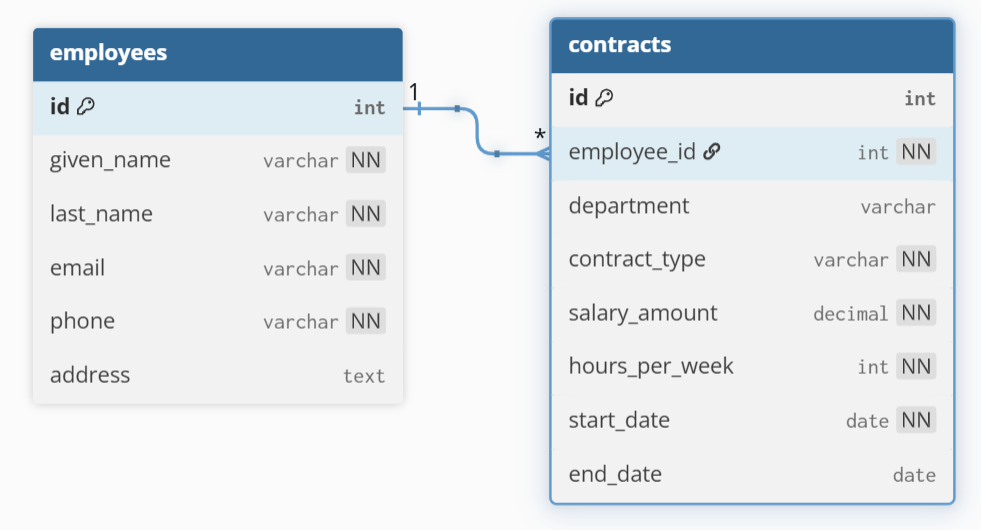

# Employee Creator Backend - Spring API

<!-- [](https://github.com/carriegale2710/employee-creator/actions/workflows/spring-ec2-deploy.yml) -->

[](https://github.com/carriegale2710/employee-creator/actions/workflows/spring-boot-test.yml) [](https://opensource.org/licenses/MIT)

## Documentation - Note

This documentation for this project is split up into backend vs front-end specific locations in the code base. They include more details like build steps, testing and change logs.

| Location                                        | Purpose                                                 |
| ----------------------------------------------- | ------------------------------------------------------- |
| [`README.md`](../README.md)                     | 🔷 High-level overview of the entire full-stack project |
| `employee/README.md` (this file)                | ⚙️ Backend-specific setup, API docs, DB, test config.   |
| [`front-end/README.md`](../front-end/README.md) | 🎨 Frontend-specific setup, dev commands, tests         |

## Build Steps - Backend Setup

<!-- - how to build / run project
- use proper code snippets if there are any commands to run -->

### Installation + Setup

```bash
# Clone the repo
git clone https://github.com/your-username/employee-creator.git
cd employee-creator

# Backend setup
./mvnw spring-boot:run

# Frontend setup
cd frontend
npm install
npm run dev

```

### Running the App Locally (macOS & Windows)

---

#### 🐬 1. Install MySQL

- **macOS**

  ```bash
  brew install mysql
  brew services start mysql
  ```

- **Windows**

  1. Download [MySQL Installer](https://dev.mysql.com/downloads/installer/)
  2. Install MySQL Server
  3. Make sure it's running as a service

---

#### 🛠️ 2. Create Database

Open MySQL shell:

```bash
mysql -u root -p
```

Then run:

```sql
CREATE DATABASE your_database_name;
```

> ✅ **Skip user creation if you're using `root` for local dev**
> Otherwise:
>
> ```sql
> CREATE USER 'your_user'@'localhost' IDENTIFIED BY 'your_password';
> GRANT ALL PRIVILEGES ON your_database_name.* TO 'your_user'@'localhost';
> FLUSH PRIVILEGES;
> ```

---

#### 📄 3. Add `.env` File

Create a `.env` file in the project root:

```env
DB_NAME=your_database_name
MYSQL_USER=your_user_or_root
MYSQL_PASS=your_password
```

---

#### 🧯 4. Fix Socket Errors [macOS Only]

If you get MySQL socket errors on Mac, force TCP:

```properties
spring.datasource.url=jdbc:mysql://127.0.0.1:3306/${DB_NAME}
```

---

#### ▶️ 5. Run the App

```bash
./mvnw spring-boot:run
```

Or use your IDE (IntelliJ, VSCode, etc.)

---

### Endpoints

Once running, your API will be available at:

```text
http://localhost:8080
```

Opening this in your browser should return "Hello, world".
Use [Postman](https://www.postman.com/downloads/) or a browser (for GET requests) to test.

- **GET all employees:**
  `http://localhost:8080/api/employees`

- **GET single employee:**
  `http://localhost:8080/api/employees/{id}`

- **POST new employee:**

  - Method: `POST`
  - URL: `http://localhost:8080/api/employees`
  - Body (JSON):

    ```json
    {
      "firstName": "Timmy",
      "lastName": "Turner",
      "email": "timmy@fairy.com"
    }
    ```

## Testing

| Type       | Tools Used       | Status |
| ---------- | ---------------- | ------ |
| Unit Tests | JUnit + Mockito  | ✅     |
| E2E Tests  | REST Assured, H2 | ✅     |

```bash
./mvnw test      # backend

```

## Backend Design Goals / Approach

## QA Checklist

- [x] App compiles and runs
- [x] Logging strategy in place
- [x] API has working CRUD endpoints (GET, CREATE, DELETE + EDIT)

  - [x] employees
  - [x] contracts

- [x] Unit + end-to-end tests (JUnit, Mockito)

  - [x] employees
  - [x] contracts

- [x] Error handling implemented
  - [x] employees
  - [x] contracts

## Features

### Database structure

Techstack: mySQL + Spring Boot JBDC

#### Entities

| Entity        | Infomation Stored | Why                                                              |
| ------------- | ----------------- | ---------------------------------------------------------------- |
| **Employees** | Personal info     | Abstract any sensitive details, restrict view access to admins   |
| **Contracts** | Job info          | Focus on the job description + legal side, save templates/drafts |

#### Relationships

| What                     | Relationship | Why                                                   |
| ------------------------ | ------------ | ----------------------------------------------------- |
| **Employee → Contracts** | One-to-Many  | Each employee can have _multiple contracts over time_ |


[ERD Diagram (DBML)](assets/diagrams/erd/erd.md)

---

### API Endpoints

#### Contracts

| ID  | Method   | Endpoint         | Input             | Output Data | Success Response |
| --- | -------- | ---------------- | ----------------- | ----------- | ---------------- |
| 1   | `GET`    | `/contracts`     | none              | DB List     | `200 OK`         |
| 2   | `GET`    | `/contracts/:id` | contract id       | DB List     | `200 OK`         |
| 3   | `POST`   | `/contracts`     | createContractDTO | DB Record   | `201 Created`    |
| 4   | `DELETE` | `/contracts/:id` | contract id       | No Content  | `204 No Content` |

#### Employees

| ID  | Method   | Endpoint         | Input                           | Output Data | Success Response |
| --- | -------- | ---------------- | ------------------------------- | ----------- | ---------------- |
| 1   | `GET`    | `/employees`     | none                            | DB List     | `200 OK`         |
| 2   | `GET`    | `/employees/:id` | employee id                     | DB List     | `200 OK`         |
| 3   | `POST`   | `/employees`     | createEmployeeDTO               | DB Record   | `201 Created`    |
| 4   | `DELETE` | `/employees/:id` | employee id                     | No Content  | `204 No Content` |
| 5   | `PATCH`  | `/employees/:id` | employee id + updateEmployeeDTO | DB Record   | `200 OK`         |

[Employees](assets/diagrams/sequence/sequence-diagram.md)


### Schemas/DTOs

#### Employees

Basic employee personal data — no department or job info here (now handled via `contracts` and `departments`).

```json
{
  "id": 1, //auto-generated in BE, needed for deletion
  //post + patch to '/employees{:id}'
  "firstName": "Timmy",
  "lastName": "Turner",
  "email": "timmehhh@example.com",
  "phone": "0400000000",
  "address": "123 Fairy Lane"
  "contracts": [
    {
      /*latest contract details
      * ...
      */
      "isActive": true
      //if no active contract...
      // we can infer they are no longer employee!
    },
        {
      /*expired or inactive contract
      * ...
      */
      "isActive": false
    }
  ]
}
```

---

#### Contracts

Each employee can have multiple contracts across different time periods and departments.

```json
{
  "id": 34, //auto-generated in BE // omit for POST requests
  "employee": {/*Employee object in BE*/} //Many-to-One relationship
  "employeeId": 15, //for DTO only to POST/PATCH -> '/contracts{:id}'
  "department": "HUMAN_RESOURCES", //select or create new one
  "contractType": "FULL_TIME",
  "salaryAmount": 80000,
  "hoursPerWeek": 38,
  "startDate": "2023-01-10", // ISO date string //required
  "endDate": null, //isActive if empty by default
  "isActive": true //virtual field (true unless endDate has past)
}
```

<!-- #### Departments

Lookup table to keep departments consistent but flexible to be updated later.

```json
// patch: {id, name} OR  post: {name}
{
  "id": 1, //not needed for POST (create)
  "name": "ENGINEERING" //opt. entered from user input in contract form
}
``` -->

---

## Licensing Details

<!-- What type of license are you releasing this under? -->

MIT License.

---

## Related projects, reimplementations, assets

### Client App UI

See related documentation for [React Client App](../front-end/README.md).

### Change Log

For detailed development history and feature updates, see [CHANGELOG.md](CHANGELOG.md).

### Future Goals

| **Section**        | **Backend Feature**                          | 🔍 Priority            | ⏱️ Time Estimate |
| ------------------ | -------------------------------------------- | ---------------------- | ---------------- |
| Employee List      | API pagination using `findAll(Pageable)`     | ⚠️ Med / High Impact   | 1–2 hrs          |
| Contract Form      | Add `createdAt` / `updatedAt` timestamps     | ⚠️ Med / Medium Impact | 1 hr             |
| Contract Form      | Track `createdAt` for recent employees logic | 🐘 Hard / Low Impact   | 1–2 hrs          |
| Address Search     | Use Google API to validate/search addresses  | 🐘 Hard / Med Impact   | 2–3 hrs          |
| Departments Entity | For flexible updates in future               | 🐘 Med / Low Impact    | 1–2 hrs          |
| Contract Drafts    | Save incomplete contract drafts              | 🐘 Hard / Low Impact   | 3–4 hrs          |

---
