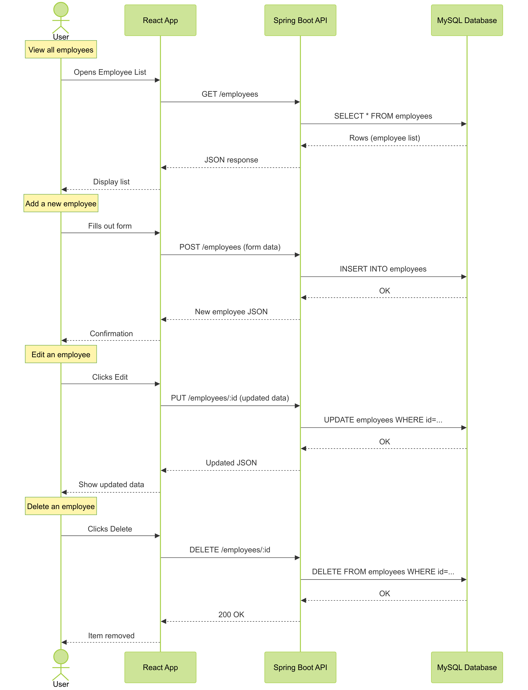

# Employee Creator Backend - Spring API

<!-- [](https://github.com/carriegale2710/employee-creator/actions/workflows/spring-ec2-deploy.yml) -->

[](https://github.com/carriegale2710/employee-creator/actions/workflows/spring-boot-test.yml) [](https://opensource.org/licenses/MIT)

### Documentation - Note

This documentation for this project is split up into backend vs front-end specific locations in the code base. They include more details like build steps, testing and change logs.

| Location                                        | Purpose                                                 |
| ----------------------------------------------- | ------------------------------------------------------- |
| [`README.md`](../README.md)                     | 🔷 High-level overview of the entire full-stack project |
| `employee/README.md` (this file)                | ⚙️ Backend-specific setup, API docs, DB, test config.   |
| [`front-end/README.md`](../front-end/README.md) | 🎨 Frontend-specific setup, dev commands, tests         |

## Build Steps - Backend Setup

<!-- - how to build / run project
- use proper code snippets if there are any commands to run -->

### Installation + Setup

```bash
# Clone the repo
git clone https://github.com/your-username/employee-creator.git
cd employee-creator

# Backend setup
./mvnw spring-boot:run

# Frontend setup
cd frontend
npm install
npm run dev

```

### Running the App Locally (macOS & Windows)

---

#### 🐬 1. Install MySQL

- **macOS**

  ```bash
  brew install mysql
  brew services start mysql
  ```

- **Windows**

  1. Download [MySQL Installer](https://dev.mysql.com/downloads/installer/)
  2. Install MySQL Server
  3. Make sure it's running as a service

---

#### 🛠️ 2. Create Database

Open MySQL shell:

```bash
mysql -u root -p
```

Then run:

```sql
CREATE DATABASE your_database_name;
```

> ✅ **Skip user creation if you're using `root` for local dev**
> Otherwise:
>
> ```sql
> CREATE USER 'your_user'@'localhost' IDENTIFIED BY 'your_password';
> GRANT ALL PRIVILEGES ON your_database_name.* TO 'your_user'@'localhost';
> FLUSH PRIVILEGES;
> ```

---

#### 📄 3. Add `.env` File

Create a `.env` file in the project root:

```env
DB_NAME=your_database_name
MYSQL_USER=your_user_or_root
MYSQL_PASS=your_password
```

---

#### 🧯 4. Fix Socket Errors [macOS Only]

If you get MySQL socket errors on Mac, force TCP:

```properties
spring.datasource.url=jdbc:mysql://127.0.0.1:3306/${DB_NAME}
```

---

#### ▶️ 5. Run the App

```bash
./mvnw spring-boot:run
```

Or use your IDE (IntelliJ, VSCode, etc.)

---

### Endpoints:

Once running, your API will be available at:

```
http://localhost:8080
```

Opening this in your browser should return "Hello, world".
Use [Postman](https://www.postman.com/downloads/) or a browser (for GET requests) to test.

- **GET all employees:**
  `http://localhost:8080/api/employees`

- **GET single employee:**
  `http://localhost:8080/api/employees/{id}`

- **POST new employee:**

  - Method: `POST`
  - URL: `http://localhost:8080/api/employees`
  - Body (JSON):

    ```json
    {
      "firstName": "Timmy",
      "lastName": "Turner",
      "email": "timmy@fairy.com"
    }
    ```

## Testing

| Type       | Tools Used       | Status |
| ---------- | ---------------- | ------ |
| Unit Tests | JUnit + Mockito  | ✅     |
| E2E Tests  | REST Assured, H2 | ⏳     |

```bash
./mvnw test      # backend

```

## Backend Design Goals / Approach

### Backend decisions

- Included a contracts and departments table with a `one-to-many relationship` for `employees -> contracts` and `departments -> contracts`
- This allows for flexible, quicker UX when editing of DB records via in FE client app with only minor updates eg. salary, contract dates etc.

## Database structure

### Entity Relationship Diagram (ERD)

[ERD Diagram (DBML)](assets/diagrams/erd/erd.md)


#### Summary

| What                       | Relationship            | Why we did this                                                    |
| -------------------------- | ----------------------- | ------------------------------------------------------------------ |
| **Employees table**        | Has personal info only  | Department can change → so not stored here                         |
| **Contracts table**        | Has job info per period | Stores department, salary, hours, type, dates for each role/period |
| **Departments table**      | Lookup table            | Keeps department names unique and consistent                       |
| **Employee → Contracts**   | One-to-Many             | - Each employee can have multiple contracts over time              |
| **Department → Contracts** | One-to-Many             | Each contract is tied to one department at that time               |

<!-- - In `Employee`:`@OneToMany(mappedBy = "employee")`
- In `Contract`:`@ManyToOne`
- In `Contract`:`@ManyToOne`
- In `Department`:`@OneToMany(mappedBy = "department")` (optional) -->

---

### Schemas

#### Employee Schema

Basic employee personal data — no department or job info here (now handled via `contracts` and `departments`).

```ts
interface Employee {
  id: number;
  firstName: string;
  lastName: string;
  email: string;
  phoneNumber?: string;
  address?: string;
}
```

```json
{
  "id": 1,
  "firstName": "Timmy",
  "lastName": "Turner",
  "email": "timmehhh@example.com",
  "phoneNumber": "0400000000",
  "address": "123 Fairy Lane"
}
```

---

#### Contract Schema

Each employee can have multiple contracts across different time periods and departments.

```ts
interface Contract {
  id: number;
  employeeId: number;
  departmentId?: number;
  contractType: "FULL_TIME" | "PART_TIME";
  salaryAmount?: number;
  hoursPerWeek?: number;
  startDate: string; // ISO date string
  endDate?: string; // ISO date string or null
  isActive: boolean;
}
```

```json
{
  "id": 101,
  "employeeId": 1,
  "departmentId": 1,
  "contractType": "FULL_TIME",
  "salaryAmount": 80000,
  "hoursPerWeek": 38,
  "startDate": "2023-01-10",
  "endDate": null,
  "isActive": true
}
```

---

#### Department Schema

Lookup table to keep departments consistent but flexible to be updated later.

```ts
interface Department {
  id: number;
  name: "ENGINEERING" | "SALES" | "HUMAN_RESOURCES" | "MARKETING" | "FINANCE";
}
```

JSON HTTP 'PUT' Request:

```json
{
  "id": 1, //not needed if "POST" request (creation)
  "name": "ENGINEERING"
}
```

---

### Sample Employee List Response (GET `/employees`)

Joining the employee with their current contract and department for display.

- Can clean up HTTP response to exclude sensitive information for security.

JSON HTTP Response:

```json
[
  {
    "id": 1,
    "firstName": "Timmy",
    "lastName": "Turner",
    "email": "timmehhh@example.com",
    "currentContract": {
      //virtual field
      "contractType": "FULL_TIME",
      "startDate": "2023-01-10",
      "department": "ENGINEERING"
    }
  },
  {
    "id": 2,
    "firstName": "Cosmo",
    "lastName": "Cosma",
    "email": "cosmo@example.com",
    "currentContract": {
      //virtual field
      "contractType": "PART_TIME",
      "startDate": "2022-04-12",
      "department": "HUMAN_RESOURCES"
    }
  }
]
```

---

### DTO Schemas

#### CreateEmployeeDTO + CreateContractDTO (opt.)

When creating a new employee with an option for initial contract:

```ts
interface CreateEmployeeDTO {
  firstName: string;
  lastName: string;
  // email: string; get backend to generate
  phoneNumber: string;
  address?: string;
  contract?: ContractDTO; //opt.
}
interface CreateContractDTO {
  departmentId: number; //get this from name
  contractType: "FULL_TIME" | "PART_TIME";
  startDate: string; // ISO date string
  salaryAmount?: number;
  hoursPerWeek?: number;
}
```

AS `POST` HTTP request (JSON):

```json
{
  "firstName": "Timmy",
  "lastName": "Turner",
  "email": "timmehhh@example.com",
  "phoneNumber": "0400000000",
  "currentContract": {
    "contractType": "FULL_TIME",
    "startDate": "2023-01-10",
    "department": "ENGINEERING"
  }
}
```

#### EditEmployeeDTO

When editing personal details of existing employee.

- As `POST` HTTP request to update only email (JSON):

```json
{
  "employee_id": 11, //required
  "email": "timmy_turner@example.com"
}
```

#### EditContractDTO

When editing personal details of existing contract.

- As `POST` HTTP request to update only salary in employee's contract (JSON):

```json
{
  "employee_id": 11, //required
  "contract_id": 101, //required
  "salaryAmount": 85000
}
```

### API Endpoints

| ID  | Method   | Endpoint         | Input             | Output Data | Success Response |
| --- | -------- | ---------------- | ----------------- | ----------- | ---------------- |
| 1   | `GET`    | `/employees`     | none              | DB List     | `200 OK`         |
| 2   | `POST`   | `/employees`     | CreateEmployeeDTO | DB Record   | `201 Created`    |
| 3   | `DELETE` | `/employees/:id` | employee id       | No Content  | `204 No Content` |
| 1   | `GET`    | `/employees/:id` | employee id       | DB Record   | `200 OK`         |

### Sequence Diagram

[Sequence Diagram](assets/diagrams/sequence/sequence-diagram.md)


## Change logs

### 05/07/2025 - Backend API Project Setup

- Installed SpringBoot and dependencies
- Setup application.properties file for mySQL
- Decided on SQL schema for employee database
- Defining data types for employees table in `assets/data/README.md`
- Linking to SQL and testing table database syncing

### 06/07/2025 - 07/07/2025 Backend API Testing setup

General

- Mapping out endpoints and status codes expected for http requests
- Created Mermaid charts for app layers and core user flows
- Introduction, build steps, testing stack research
- Research on TDD framework
- Cleaning up assets and documentation org//

Backend API

- Created simple HomeController and tested app runs in localhost:8080 browser
- Create Employee entity with getters and setters
- Creates basic employee controller, service, repository classes.
- Write code for basic get method

Backend E2E Test

- Installs `spring-boot-starter-test dependency` which includes JUnit, Mockito, and other useful testing libraries.
- Installs dependency for H2 database for testing with separate db - avoid breaking from actual DB.
- Installs Rest Assured Library for writing automated test that send requests during testing.
- Adds records for e2e test setup using H2 database for mocking with dummy data
  - Creates basic test for `getAll()`
- test badges update - Github actions

### 08/07/2025 - Basic CRUD endpoints + Writing tests

Created endpoints for:

- `GET` `/employees` = [DB -> list (of records)]
- `GET` `/employees/{id}` = [DB -> record]
- `POST` `/employees` = [DB + record]
- `DELETE` `/employee/{id}` = [DB - record]

API Test Setup:

- Fixed Github workflows for automated testing (see badges at top)
- Outlined e2e test cases and edges for new all endpoints
- Fixed application.properties config bug for test suite
- Created config folder for ModelMapper library - easier to create new entities compared to manual setters
- Created JSON schema for e2e test for creating new employees in DB
- SmokeTest sanity check test
- writing unit tests for Service layer (business logic)

### 10/07/2025 - Spring App EC2 Deployment

- fixed bug with env variables not loading into application.properties for backend by changing file name
- Successfully deployed backend Spring App to EC2 instance in AWS - Available at: `ec2-3-107-209-102.ap-southeast-2.compute.amazonaws.com:8080/employees`

### 12/07/2025 - Custom Domain for API

- Created new healthcheck controller endpoint for testing load balancer

- Bought custom domain from porkbun - to be implemented:
- Started: Auto-deployment workflow for Spring App EC2 Deployment (not working yet) (on hold)

### 14/07/2025 - API Logging

- API logging strategy:
  - implemented SLF4J facade in EmployeeApplication controller class
  - created dev profile for console and file log formats and level filtering
  - configured SLF4J to use Log4j2 instead of default (Logback)
  - created log4j2-spring.xml for log configuration and formatting, with dev profile

### 19/07/2025

Working on `Delete employee record`:

- Return `BAD REQUEST` if wrong input - fixed
- Return `NO_CONTENT` on successful deletion - fixed

---

Agile Board

### In progress

### Sprint

- go back and introduce error handling for backend API
- prepare data handling on backend to make front-end just an IO (goal: reduce front-end complexity)

### Backlog - Backend

- BE feature: Edit employee record:

  - editById PUT method - TDD - write tests + function in parallel

## QA Checklist

### 🔧 Backend (Spring Boot)

- [x] App compiles and runs
- [ ] API has working CRUD endpoints (GET, CREATE, DELETE + EDIT)
- [x] Unit + end-to-end tests (JUnit, Mockito)
- [ ] Error handling implemented
- [x] Logging strategy in place

### 🚚 Delivery & Deployment

- [x] README includes clear setup steps for both API and Web app (local dev)
- [x] Hosting link works (Heroku, AWS, Azure, etc.)
- [ ] Code is clean + well documented
- [x] App is production-ready
- [ ] Codebase is understandable and maintainable
- [x] Bug-free and everything compiles + runs as expected

## Licensing Details

<!-- What type of license are you releasing this under? -->

MIT License.

---

## Related projects, reimplementations, misc.

### Client App UI

See related documentation for [React Client App](front-end/README.md).
