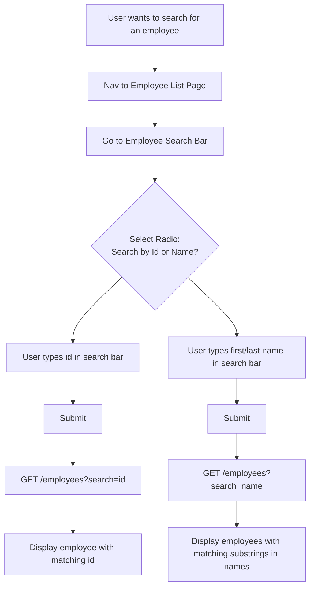

```mermaid
flowchart TD

%% --- Employee Search Bar (List Page) ---
E1[User wants to search for an employee]
--> E2[Nav to Employee List Page]
--> E3[Go to Employee Search Bar]
--> E4{Select Radio:<br>Search by Id or Name?}

E4 --> F1[User types id in search bar]
--> F2[Submit]
--> F3[GET /employees?search=id]
--> F4[Display employee with matching id]

E4 --> G1[User types first/last name in search bar]
--> G2[Submit]
--> G3[GET /employees?search=name]
--> G4[Display employees with matching substrings in names]

```
