# Employee Creator Frontend / Client App

[](https://github.com/carriegale2710/employee-creator/actions/workflows/react-deploy.yml)

---

## Introduction

### Implementation: Front-end decisions

<!-- Why did you implement this the way you did? -->

- Used top-down TDD to define backend before connecting to frontend.
- Write up basic tests before coding to understand functionality, entity shapes & edge cases.
- Break up app into simplified components.
- Reuse the same presentational for component for both editing and creation functions.

### Techstack

- React: SPA for responsive layout
- Typescript: validating forms for user input before being sent to DB saves time in both DX and UX.
- SCSS/Tailwind: For modular, reusable styles and themes based on design systems.

---

⚒️ Setup

Follow these steps to run the React app locally using Vite + TypeScript:

1. Clone the Repo

git clone https://github.com/carriegale2710/employee-creator.git
cd employee-creator/front-end

2. Install Dependencies

Make sure you have Node.js v18+ installed.

`npm install`

3. Set Up Environment Variables

Create a .env file in the root of the front-end folder:

`touch .env`

Inside .env, add:

`VITE_API_KEY=your-api-key-here`

> 🔐 Note: All Vite environment variables must be prefixed with VITE\_ to be accessible in the frontend code.

You can now access it in your React code using:

`const apiKey = import.meta.env.VITE_API_KEY;`

3. Run the Development Server

`npm run dev`

The app will be available at http://localhost:5173

4. (Optional) Build for Production

`npm run build`

5. (Optional) Preview Production Build

`npm run preview`

---

## Testing

### Running tests

Techstack used: Vitest

```bash
npm run test
```

### Test Approach

- Main Purpose: "Does the user interface act like it should when I use it?"

- TDD: write test, pass, refactor for each new feature/component. Avoid overbuilding before MVP.

- Component Tests: Good for testing individual functionality quickly.

Right now, testing public features only:

- What the user sees (rendering, UI)
- What the user does (onClick, onSubmit, onHover)
- What the user expects (data, nav, buttons)

| Test Type      | Example Test                               |
| -------------- | ------------------------------------------ |
| UI rendering   | “Form loads with all fields”               |
| User flow      | “User can submit form and see success msg” |
| Validation     | “Shows error for empty email”              |
| Error handling | “Shows message if server fails”            |

---

### Design Goals / QA Checklist

#### 💻 Frontend MVP (React + TypeScript)

- [x] React app compiles and runs (Vite)
- [x] Basic CRUD employee functionality works
- [x] Form validation added
- [x] Optional testing included (Vitest/Zod)
- [x] UI styled + responsive (SCSS/Tailwind)

#### Core Flows

- [x] Page loads with correct data from backend (GET)
- [x] Form inputs accept user input
- [x] Form submits valid data successfully (POST/PATCH)
- [x] Item can be deleted (DELETE)
- [x] Navigation or redirects work after actions

#### Error Handling

- [x] Required fields show validation error if empty
- [x] Invalid input (e.g. bad email) is blocked
- [ ] Backend error (e.g. 400 or 500) shows helpful message
- [ ] Loading and error states show something visible (e.g. spinner or alert)

#### User Experience

- [x] Mobile/responsive layout works (test one small screen)
- [ ] Buttons and links are clickable and have visual feedback
- [x] Basic keyboard navigation works (Tab, Enter)
- [x] No obvious visual glitches after user actions
- [ ] Toasts or alerts auto-dismiss after success

---

## Features

Note: \* = MVP (priority)

### User Stories

| ID  | Feature               | User Wants To...         | So They Can...            | User should be able to...                                                        |
| --- | --------------------- | ------------------------ | ------------------------- | -------------------------------------------------------------------------------- |
| 1   | `List Employees`      | \*See all employees      | Review records            | Click link to view a paginated list of all employee records                      |
| 2   | `Create Employee`     | \*Add a new employee     | Register new hire         | Click button that opens a form to add a new employee as a new record in DB       |
| 3   | `Delete Employee`     | \*Delete employee        | Remove old record         | Click a button to delete a record of an existing employee in DB                  |
| 4   | `Update Employee`     | \*Edit existing employee | Fix errors or update info | Click an edit button that opens a form pre-filled with data to update the record |
| 5   | `Find Employee by ID` | Search specific employee | View or confirm details   | Enter an ID in a search box and fetch/display the record if it exists            |

### 📄 Contract Features Table

Each **employee can have multiple contracts**, and contracts are managed separately but linked to employees (like foreign key via `employeeId`).

NOTE - Since contracts are legal documents, we don't want them to be mutable ie. no update contract function.

| ID  | Feature                         | User Wants To...                    | So They Can...               | User should be able to...                                                            |
| --- | ------------------------------- | ----------------------------------- | ---------------------------- | ------------------------------------------------------------------------------------ |
| 1   | `List Contracts`                | See all contracts                   | Review records               | Click link to view a paginated list of all contracts (with optional employee filter) |
| 2   | `Create Contract`               | \*Add a new contract                | Register new agreement       | Click button that opens a form to add a new contract linked to an employee           |
| 3   | `Delete Contract`               | Remove a contract                   | Get rid of outdated info     | Click a delete button to remove a contract from the DB                               |
| 4   | `Find Contract by ID`           | \*View a specific contract          | Check specific terms/details | Enter a contract ID to fetch and display its details                                 |
| 5   | `List Contracts by Employee ID` | \*View all contracts for 1 employee | Track one employee’s history | Click from employee page to view all contracts linked to that employee               |

---

## Design Snippets

### Mockups

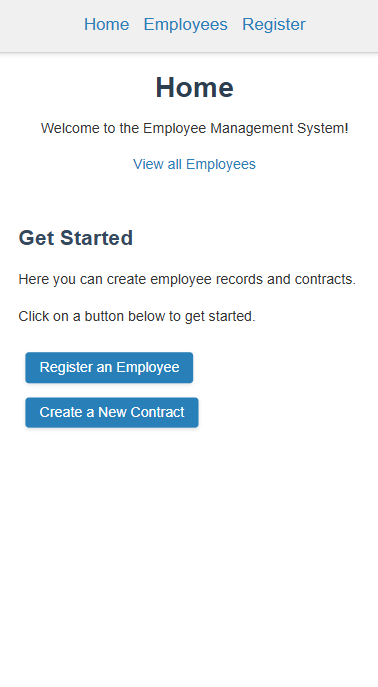
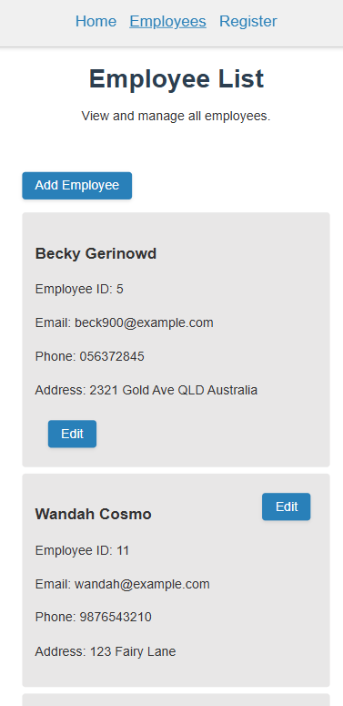
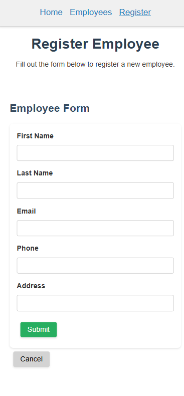
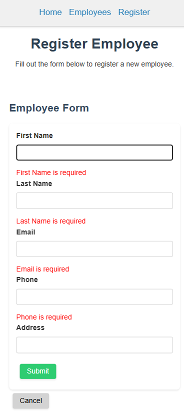

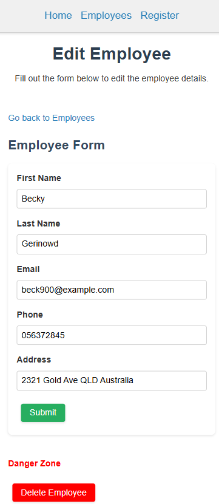
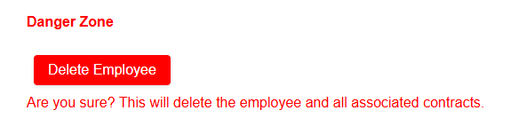

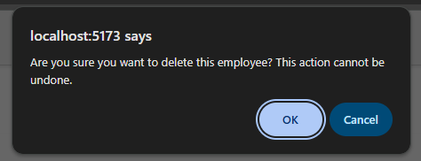

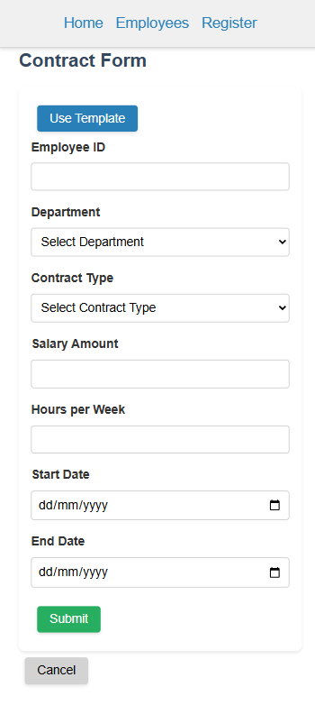
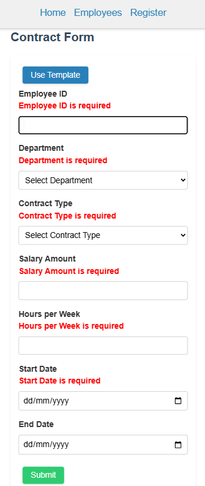

#### Component Nesting

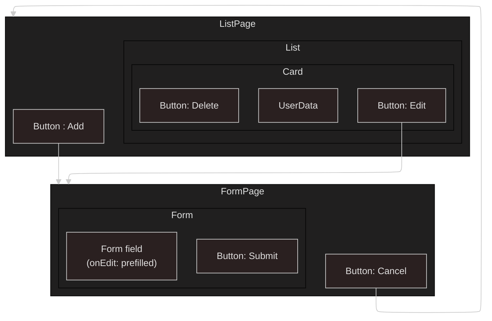

### Wireframes

#### List Page


#### Form Page


### Flows

#### Data Flow between React components


### User Flows

#### Employee Add/Edit Form

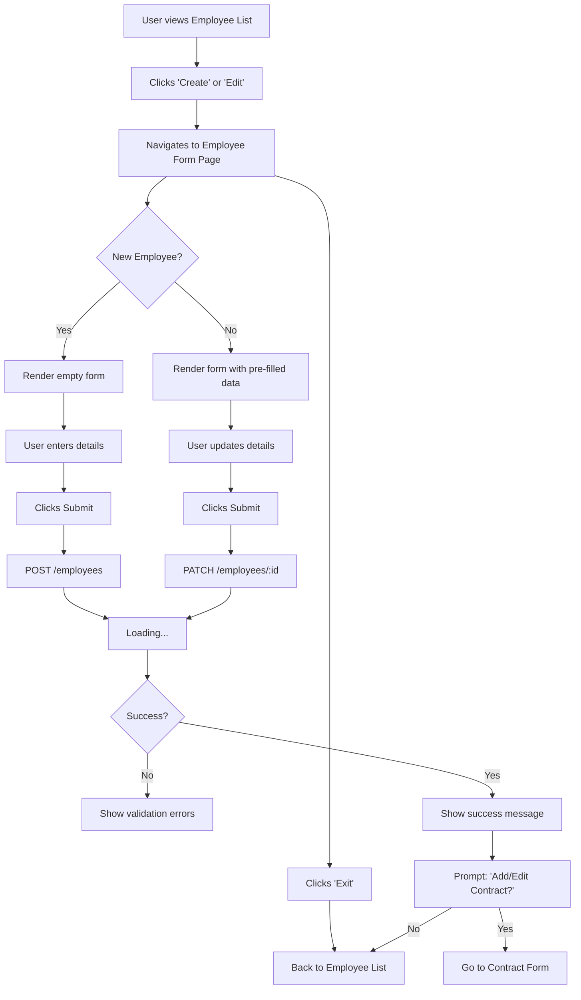

#### Contract Add/Edit Form

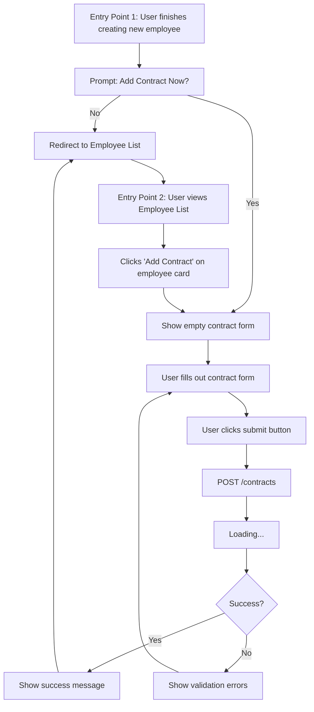

---

## Sprint Backlog

### Due Aug 1st 10:30am

- [ ] ✅ Only show contract creation on task card (remove from homepage)  
       ⏱️ 0.5 hr

- [ ] ⚠️ Add “Next: Add contract” in Employee Form wiht pre-filled info
      ⏱️ 1 hr

- [ ] ⚠️ Add Zod validation to Employee and Contract forms  
       ⏱️ 2 hrs

- [ ] ⚠️ Build + test full MVP user flow demo: Home > Create > Forms > Toast > List  
       ⏱️ 3 hrs

- [ ] ⚡ **Prepare project showcase slideshow** (for mock interview/demo)  
       ⏱️ 3 hrs  
       📌 _Include_:  
       - Overview of app (what it does)  
       - MVP scope and user flow  
       - Tech stack + decisions (e.g. Tailwind, TDD, DTOs)  
       - Obstacles & what you learned (esp. solo dev insight)  
       - Screenshots or demo video

### 23/07/2025

## Future Goals

| **Section**      | **Frontend Feature**                                               | 🔍 Priority            | ⏱️ Time Estimate |
| ---------------- | ------------------------------------------------------------------ | ---------------------- | ---------------- |
| Employee List    | Searchbar for name/ID (query params from form)                     | ⚠️ Med / High Impact   | 2–3 hrs          |
| Contract Form    | - "Back to employee form" button <br> - Final confirmation step    | ⚠️ Med / Medium Impact | 1–1.5 hrs        |
| Styling          | Gather/import design system assets (fonts, spacing, etc.)          | 🐘 Med / Low Impact    | 1–2 hrs          |
| Styling          | Install Tailwind CSS + Use Tailwind Play to preview designs        | 🐘 Med / Low Impact    | 1 hr             |
| Styling          | Delete redundant SCSS files and refactor to Tailwind               | 🐘 Hard / low Impact   | 2-3 hrs          |
| Contract History | View contracts per employee (contract history GET /contracts{:id}) | 🐘 Med / Low Impact    | 1–2 hrs          |
| Contract Drafts  | View/edit saved drafts (GET /contracts/{:id}/drafts)               | 🐘 Hard / low Impact   | 3–4 hrs          |
| Contract Form    | Dropdown: 5 recent employees (last_updated + created timestamps)   | 🐘 Hard / High Impact  | 2–4 hrs          |

---

## Resources

- https://react.dev/learn/thinking-in-react
- https://react.dev/learn/reusing-logic-with-custom-hooks


## Change Log

For detailed development history and feature updates, see [CHANGELOG.md](CHANGELOG.md).
