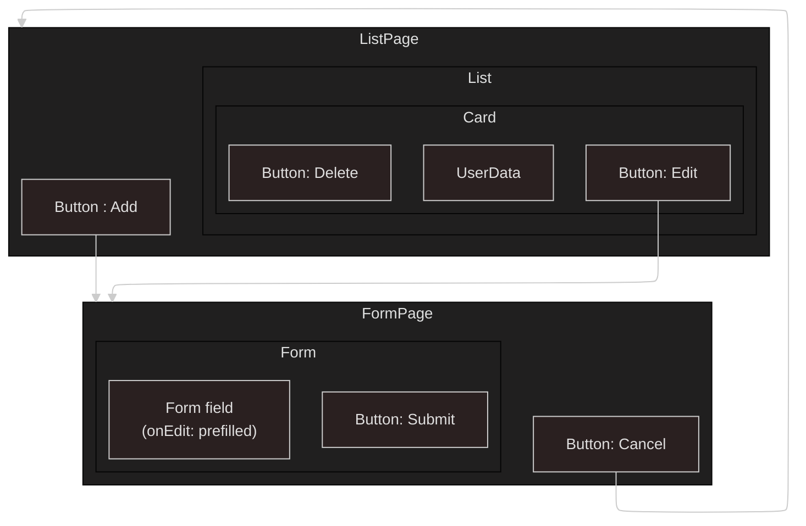

# Employee Creator Frontend / Client App

[](https://github.com/carriegale2710/employee-creator/actions/workflows/react-deploy.yml)

---

## Introduction

### Implementation: Front-end decisions

<!-- Why did you implement this the way you did? -->

- Used top-down TDD to define backend before connecting to frontend.
- Write up basic tests before coding to understand functionality, entity shapes & edge cases.

### Techstack

- React: SPA for responsive layout
- Typescript: validating forms for user input before being sent to DB saves time in both DX and UX.
- SCSS/Tailwind: For modular, reusable styles and themes based on design systems.

---

## Setup

### React Frontend Setup Steps

TBA

1. Installation
2. Setup
3. Running the React App

---

## Testing

The app UI is pretty minimal and straightforward (just CRUD), so I will only test internals/implementation for now in order to speed up production.

More advanced testing like data and fetching should be abstracted to the backend, hence e2e and integration tests will be pushed back until more advanced features like signup/login flows are created.

FE testing will be more for ensuring correct validation/error handling on create/edit features in the Form component, as this is where most unexpected user inputs/interaction may occur.

### Running tests

Techstack used: Vitest + Zod

```bash
npm run test
```

### Test Approach

- Main Purpose: "Does the user interface act like it should when I use it?"

- TDD: write test, pass, refactor for each new feature/component. Avoid overbuilding before MVP.

- Component Tests: Good for testing individual functionality quickly.

Right now, testing public features only:

- What the user sees (rendering, UI)
- What the user does (onClick, onSubmit, onHover)
- What the user expects (data, nav, buttons)

| Test Type      | Example Test                               |
| -------------- | ------------------------------------------ |
| UI rendering   | “Form loads with all fields”               |
| User flow      | “User can submit form and see success msg” |
| Validation     | “Shows error for empty email”              |
| Error handling | “Shows message if server fails”            |

---

## UI Design

### User Stories to fufill

| ID  | Feature           | User Wants To...   | So They Can...    | User should be able to...                                                  |
| --- | ----------------- | ------------------ | ----------------- | -------------------------------------------------------------------------- |
| 1   | `List Employees`  | See all employees  | Review records    | Click link to view a paginated list of all employee records                |
| 2   | `Create Employee` | Add a new employee | Register new hire | Click button that opens a form to add a new employee as a new record in DB |
| 3   | `Delete Employee` | Delete employee    | Remove old record | Click a button to delete a record of an existing employee in DB            |

### QA Checklist

### 💻 Frontend MVP (React + TypeScript)

- [x] React app compiles and runs (Vite)
- [ ] Basic CRUD employee functionality works
- [ ] Form validation added
- [x] Optional testing included (Vitest/Zod)
- [ ] UI styled + responsive (SCSS/Tailwind)

### Core Flows

- [x] Page loads with correct data from backend (GET)
- [ ] Form inputs accept user input
- [ ] Form submits valid data successfully (POST/PUT)
- [ ] Item can be deleted (DELETE)
- [ ] Navigation or redirects work after actions

### Error Handling

- [ ] Required fields show validation error if empty
- [ ] Invalid input (e.g. bad email) is blocked
- [ ] Backend error (e.g. 400 or 500) shows helpful message
- [ ] Loading and error states show something visible (e.g. spinner or alert)

### User Experience

- [ ] Mobile/responsive layout works (test one small screen)
- [ ] Buttons and links are clickable and have visual feedback
- [ ] Basic keyboard navigation works (Tab, Enter)
- [ ] No obvious visual glitches after user actions
- [ ] Toasts or alerts auto-dismiss after success

---

## Mockups (brief)


## Wireframes

List Page


Form Page


## Flows

CRUD Flow between React components


## React Components



<!--
### React Code Structure

| File                   | Purpose                                                  |
| ---------------------- | -------------------------------------------------------- |
| `employeeService.js`   | Handles raw API calls (GET, POST, PUT, DELETE)           |
| `useEmployees.js`      | Manages local state + calls service + keeps list in sync |
| `EmployeeListPage.jsx` | Renders the list and uses the hook                       |
| `EmployeeForm.jsx`     | Reuses hook to trigger updates after submit              |
 -->

---

## Change logs

### 09/07/2025 - Front-end Planning + Creation

- deconstruct UI design mockups provided into React components using Figma (+ bonus data flow Mermaid diagram)
- install Vite + TypeScript + Scss to create React front-end
- create employee-service.ts to render fetch data from DB
- create basic React presentational components: List, Card, Button
- employee services: getAll() , getById()
- backend: Implemented Webconfig for CORS errors
- render and pass data from Page -> List -> Card
- basic scss styling of Card

### 11/07/2025 - S3 React Deployment

- Deployed React front-end as [static app](https://d3bcyx0s1yb5do.cloudfront.net/) in AWS S3 (Simple Storage Service):
- Created React build, test and deploy [Github workflow](.github/workflows/react-deploy.yml)

### 15/07/2025

- Deconstructed React components for List and Form pages.

Database Schema Updates:

- Department is no longer stored directly in the Employee schema
- Start date and department are now part of the Contract entity
- Employees can have multiple contracts
- See updated ['Database Structure' README](assets/data/README.md) for more

### 16/07/2025

- Edit feature prefilled form with data from card + added changes
- Form tests

---

## Agile Board

### In progress

- Create basic form inputs and submit button(use React Form API?)

### Sprint

Form React UI for create/edit features:

- create : send data POST

- structure in index and partials/variables: color palette, typography
- write up reusable mixins: eg. flexbox wrappers
- validation with zod

### Backlog

Form validation

UI styling - Global styling

- research SCSS vs tailwind styling for React components
- gather and import design system assets

- explore UI libraries /inspo if time (produce UI MVP ref first)

---
