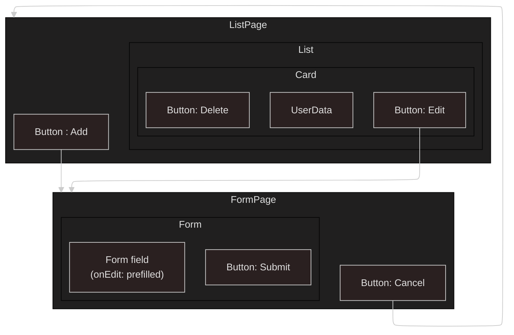

# Client App (Employee-Creator Front-end)

[](https://github.com/carriegale2710/employee-creator/actions/workflows/react-deploy.yml)

## Techstack

- React: SPA for responsive layout
- Typescript: validating forms for user input before being sent to DB saves time in both DX and UX.
- SCSS/Tailwind: For modular, reusable styles and themes based on design systems.

## Mockups (brief)


## Wireframes

List Page


Form Page


## Flows

CRUD Flow between React components


## React Components



<!--
### React Code Structure

| File                   | Purpose                                                  |
| ---------------------- | -------------------------------------------------------- |
| `employeeService.js`   | Handles raw API calls (GET, POST, PUT, DELETE)           |
| `useEmployees.js`      | Manages local state + calls service + keeps list in sync |
| `EmployeeListPage.jsx` | Renders the list and uses the hook                       |
| `EmployeeForm.jsx`     | Reuses hook to trigger updates after submit              |
 -->

---

## Testing

Techstack used: Vitest + Zod

### Run Front-end tests

```bash
npm run test
```

### Test Approach

- Main Purpose: "Does the user interface act like it should when I use it?"

- TDD: write test, pass, refactor for each new feature/component. Avoid overbuilding before MVP.

- Component Tests: Good for testing individual functionality quickly.

### Test Goals

FE testing will be more for ensuring correct validation/error handling on create/edit features in the Form component, as this is where most unexpected user inputs/interaction may occur.

Right now, testing public features only:

- What the user sees (rendering, UI)
- What the user does (onClick, onSubmit, onHover)
- What the user expects (data, nav, buttons)

| Test Type      | Example Test                               |
| -------------- | ------------------------------------------ |
| UI rendering   | “Form loads with all fields”               |
| User flow      | “User can submit form and see success msg” |
| Validation     | “Shows error for empty email”              |
| Error handling | “Shows message if server fails”            |

Note: The app UI is pretty minimal and straightforward (just CRUD), so I will only test internals/implementation for now in order to speed up production. More advanced testing like data and fetching should be abstracted to the backend, hence e2e and integration tests will be pushed back until more advanced features like signup/login flows are created.

### Minimal E2E Test Checklist

#### Core Flows

- [x] Page loads with correct data from backend (GET)
- [ ] Form inputs accept user input
- [ ] Form submits valid data successfully (POST/PUT)
- [ ] Item can be deleted (DELETE)
- [ ] Navigation or redirects work after actions

#### Error Handling

- [ ] Required fields show validation error if empty
- [ ] Invalid input (e.g. bad email) is blocked
- [ ] Backend error (e.g. 400 or 500) shows helpful message
- [ ] Loading and error states show something visible (e.g. spinner or alert)

#### User Experience

- [ ] Mobile/responsive layout works (test one small screen)
- [ ] Buttons and links are clickable and have visual feedback
- [ ] Basic keyboard navigation works (Tab, Enter)
- [ ] No obvious visual glitches after user actions
- [ ] Toasts or alerts auto-dismiss after success

---

## React + TypeScript + Vite

This template provides a minimal setup to get React working in Vite with HMR and some ESLint rules.

Currently, two official plugins are available:

- [@vitejs/plugin-react](https://github.com/vitejs/vite-plugin-react/blob/main/packages/plugin-react) uses [Babel](https://babeljs.io/) for Fast Refresh
- [@vitejs/plugin-react-swc](https://github.com/vitejs/vite-plugin-react/blob/main/packages/plugin-react-swc) uses [SWC](https://swc.rs/) for Fast Refresh

### Expanding the ESLint configuration

If you are developing a production application, we recommend updating the configuration to enable type-aware lint rules:

```js
export default tseslint.config([
  globalIgnores(["dist"]),
  {
    files: ["**/*.{ts,tsx}"],
    extends: [
      // Other configs...

      // Remove tseslint.configs.recommended and replace with this
      ...tseslint.configs.recommendedTypeChecked,
      // Alternatively, use this for stricter rules
      ...tseslint.configs.strictTypeChecked,
      // Optionally, add this for stylistic rules
      ...tseslint.configs.stylisticTypeChecked,

      // Other configs...
    ],
    languageOptions: {
      parserOptions: {
        project: ["./tsconfig.node.json", "./tsconfig.app.json"],
        tsconfigRootDir: import.meta.dirname,
      },
      // other options...
    },
  },
]);
```

You can also install [eslint-plugin-react-x](https://github.com/Rel1cx/eslint-react/tree/main/packages/plugins/eslint-plugin-react-x) and [eslint-plugin-react-dom](https://github.com/Rel1cx/eslint-react/tree/main/packages/plugins/eslint-plugin-react-dom) for React-specific lint rules:

```js
// eslint.config.js
import reactX from "eslint-plugin-react-x";
import reactDom from "eslint-plugin-react-dom";

export default tseslint.config([
  globalIgnores(["dist"]),
  {
    files: ["**/*.{ts,tsx}"],
    extends: [
      // Other configs...
      // Enable lint rules for React
      reactX.configs["recommended-typescript"],
      // Enable lint rules for React DOM
      reactDom.configs.recommended,
    ],
    languageOptions: {
      parserOptions: {
        project: ["./tsconfig.node.json", "./tsconfig.app.json"],
        tsconfigRootDir: import.meta.dirname,
      },
      // other options...
    },
  },
]);
```
