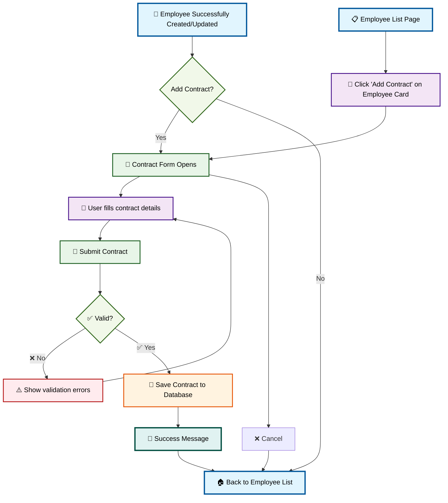

# Contract Form Flow

```mermaid
flowchart TD
    %% Entry points
    A[🎉 Employee Successfully Created/Updated] --> B{Add Contract?}
    C[📋 Employee List Page] --> D[📄 Click 'Add Contract' on Employee Card]

    %% Decision paths
    B -->|Yes| E[📝 Contract Form Opens]
    B -->|No| F[🏠 Back to Employee List]
    D --> E

    %% Form interaction
    E --> G[👤 User fills contract details]
    G --> H[🚀 Submit Contract]

    %% Validation
    H --> I{✅ Valid?}
    I -->|❌ No| J[⚠️ Show validation errors]
    J --> G

    %% Success flow
    I -->|✅ Yes| K[💾 Save Contract to Database]
    K --> L[🎉 Success Message]
    L --> F

    %% Cancel option
    E --> M[❌ Cancel]
    M --> F

    %% Styling
    classDef startEnd fill:#e1f5fe,stroke:#01579b,stroke-width:3px,color:#000
    classDef userAction fill:#f3e5f5,stroke:#4a148c,stroke-width:2px,color:#000
    classDef form fill:#e8f5e8,stroke:#1b5e20,stroke-width:2px,color:#000
    classDef process fill:#fff3e0,stroke:#e65100,stroke-width:2px,color:#000
    classDef success fill:#e0f2f1,stroke:#004d40,stroke-width:3px,color:#000
    classDef error fill:#ffebee,stroke:#b71c1c,stroke-width:2px,color:#000
    classDef decision fill:#f1f8e9,stroke:#33691e,stroke-width:2px,color:#000

    class A,C,F startEnd
    class D,G userAction
    class E,H form
    class K process
    class L success
    class J error
    class B,I decision
```
