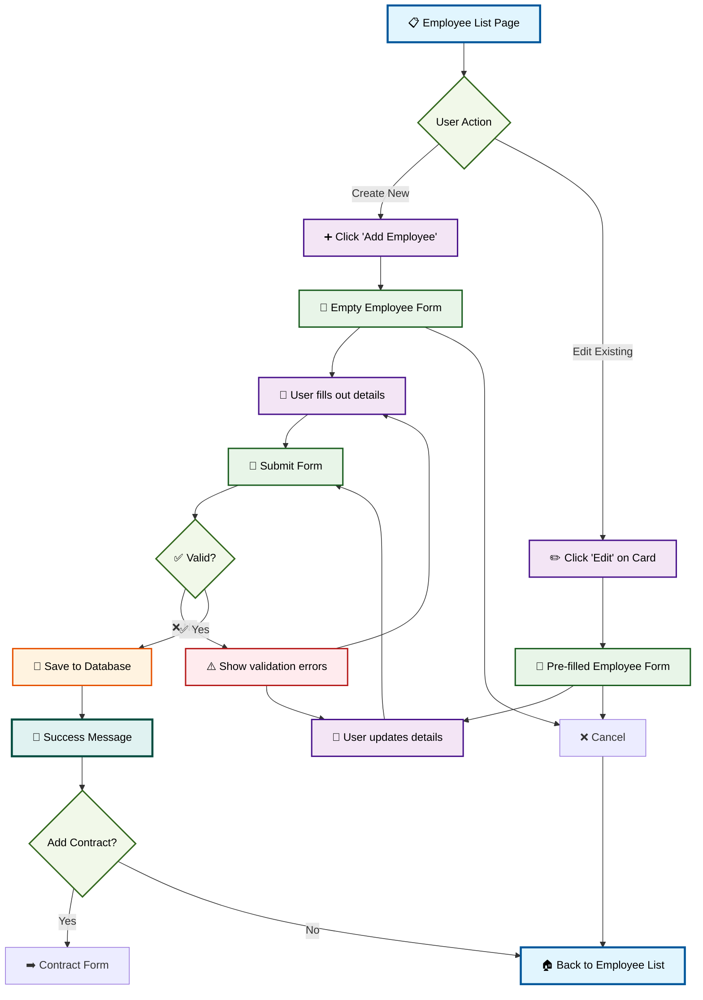

# Employee Form Flow

```mermaid
flowchart TD
    %% Start
    A[📋 Employee List Page] --> B{User Action}

    %% Two paths
    B -->|Create New| C[➕ Click 'Add Employee']
    B -->|Edit Existing| D[✏️ Click 'Edit' on Card]

    %% Form rendering
    C --> E[📝 Empty Employee Form]
    D --> F[📝 Pre-filled Employee Form]

    %% User interaction
    E --> G[👤 User fills out details]
    F --> H[👤 User updates details]

    %% Submission
    G --> I[🚀 Submit Form]
    H --> I

    %% Processing
    I --> J{✅ Valid?}
    J -->|❌ No| K[⚠️ Show validation errors]
    K --> G
    K --> H

    %% Success
    J -->|✅ Yes| L[💾 Save to Database]
    L --> M[🎉 Success Message]

    %% Next steps
    M --> N{Add Contract?}
    N -->|Yes| O[➡️ Contract Form]
    N -->|No| P[🏠 Back to Employee List]

    %% Cancel option
    E --> Q[❌ Cancel]
    F --> Q
    Q --> P

    %% Styling
    classDef startEnd fill:#e1f5fe,stroke:#01579b,stroke-width:3px,color:#000
    classDef userAction fill:#f3e5f5,stroke:#4a148c,stroke-width:2px,color:#000
    classDef form fill:#e8f5e8,stroke:#1b5e20,stroke-width:2px,color:#000
    classDef process fill:#fff3e0,stroke:#e65100,stroke-width:2px,color:#000
    classDef success fill:#e0f2f1,stroke:#004d40,stroke-width:3px,color:#000
    classDef error fill:#ffebee,stroke:#b71c1c,stroke-width:2px,color:#000
    classDef decision fill:#f1f8e9,stroke:#33691e,stroke-width:2px,color:#000

    class A,P startEnd
    class C,D,G,H userAction
    class E,F,I form
    class L process
    class M success
    class K error
    class B,J,N decision
```
